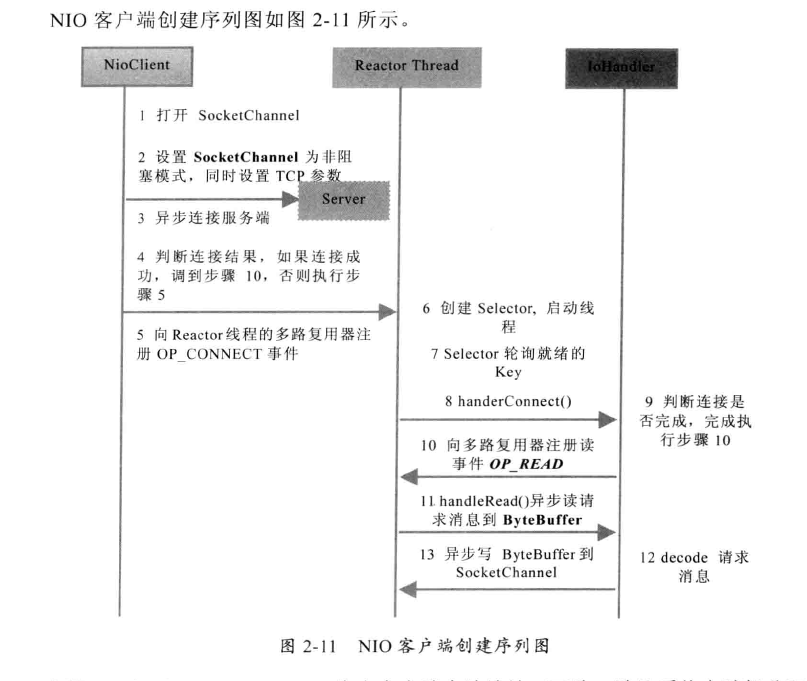

## Netty

#### 1. 传统BIO

- **阻塞式**

  ```
  This method blocks until input data is available, end of file is detected, or an exception is thrown
  public int read(byte b[]) throws IOException {
   	return read(b, 0, b.length);
  }
  ```

- **每个客户端连接都需要一个单独的线程处理**

#### 2. NIO

- **缓冲区Buffer**

  ```
  1. netty读取数据都是通过缓冲区来处理的，缓冲区实际上是一个数组，有ByteBuffer、CharBuffer。。。
  2. 缓冲区维护了需要读取的数据和offset
  ```

- **通道Channel**

  ```
  1. Channel是数据的读写通道，与传统的InputStream或OutputStream不同，Channel是双向的，可以同时进行读和写
  2. Channel主要分为两大类：网络读写和文件操作
  ```

- **多路复用器 selector**

  ```
  selector可以轮询注册在自身上的Channel，一旦Channel发生读或者写的操作，selector就可以通过selectionKey获取就绪的Channel，再继续后续的IO操作
  ```

  

- **NIO服务端**

  

  

- **NIO客户端**

  

  