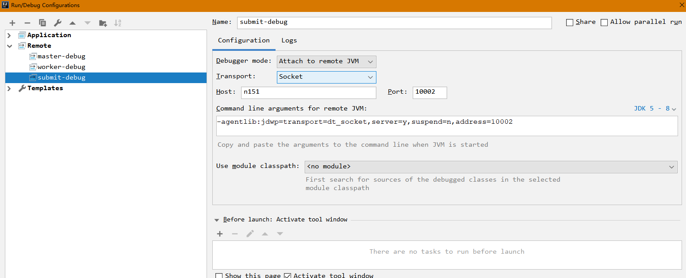
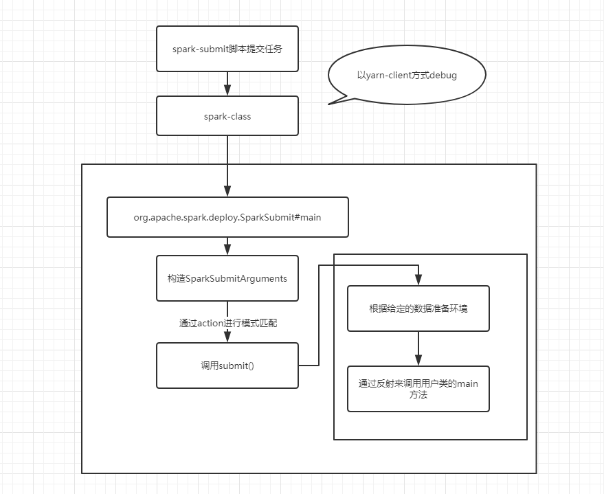

## 1. spark-submit流程解析

### 1. spark-submit脚本内容

```
# 判断SPARK_HOME是否设置
if [ -z "${SPARK_HOME}" ]; then
  source "$(dirname "$0")"/find-spark-home
fi

# disable randomized hash for string in Python 3.3+
export PYTHONHASHSEED=0

#调用spark-class脚本进行任务提交
exec "${SPARK_HOME}"/bin/spark-class org.apache.spark.deploy.SparkSubmit "$@"
```

**spark-class**脚本内容见**start-master.sh脚本分析**

### 2. SparkSubmit执行内容(main方法)

```scala
override def main(args: Array[String]): Unit = {
    //具体解析见2.1 new SparkSubmitArguments(args)
    val appArgs = new SparkSubmitArguments(args)
    if (appArgs.verbose) {
      // scalastyle:off println
      printStream.println(appArgs)
      // scalastyle:on println
    }
    appArgs.action match {
      //具体解析见2.2 submit(appArgs)
      case SparkSubmitAction.SUBMIT => submit(appArgs)
      case SparkSubmitAction.KILL => kill(appArgs)
      case SparkSubmitAction.REQUEST_STATUS => requestStatus(appArgs)
    }
}
```

#### **2.1 new SparkSubmitArguments(args)**

```scala
// 解析并设置命令行传入的参数
try {
	parse(args.asJava)
} catch {
	case e: IllegalArgumentException =>
		SparkSubmit.printErrorAndExit(e.getMessage())
}
// 加载spark-default.properties配置文件中的值,存入sparkProperties
mergeDefaultSparkProperties()
// 移除不以spark.开头的属性
ignoreNonSparkProperties()
// 加载环境变量中的spark属性，具体逻辑查看2.1.1
loadEnvironmentArguments()
// 对参数进行校验
validateArguments()
```

##### 2.1.1 loadEnvironmentArguments()

```scala
private def loadEnvironmentArguments(): Unit = {
    master = Option(master)
      // sparkProperties中代表的是spark-defaults.conf和命令行输入的参数
      // 由此可知，env中的参数的优先级是低于命令行和配置文件中参数的优先级的
      .orElse(sparkProperties.get("spark.master"))
      .orElse(env.get("MASTER"))
      .orNull
    driverExtraClassPath = Option(driverExtraClassPath)
      .orElse(sparkProperties.get("spark.driver.extraClassPath"))
      .orNull
    driverExtraJavaOptions = Option(driverExtraJavaOptions)
      .orElse(sparkProperties.get("spark.driver.extraJavaOptions"))
      .orNull
    driverExtraLibraryPath = Option(driverExtraLibraryPath)
      .orElse(sparkProperties.get("spark.driver.extraLibraryPath"))
      .orNull
    driverMemory = Option(driverMemory)
      .orElse(sparkProperties.get("spark.driver.memory"))
      .orElse(env.get("SPARK_DRIVER_MEMORY"))
      .orNull
    driverCores = Option(driverCores)
      .orElse(sparkProperties.get("spark.driver.cores"))
      .orNull
    executorMemory = Option(executorMemory)
      .orElse(sparkProperties.get("spark.executor.memory"))
      .orElse(env.get("SPARK_EXECUTOR_MEMORY"))
      .orNull
    executorCores = Option(executorCores)
      .orElse(sparkProperties.get("spark.executor.cores"))
      .orElse(env.get("SPARK_EXECUTOR_CORES"))
      .orNull
    totalExecutorCores = Option(totalExecutorCores)
      .orElse(sparkProperties.get("spark.cores.max"))
      .orNull
    name = Option(name).orElse(sparkProperties.get("spark.app.name")).orNull
    jars = Option(jars).orElse(sparkProperties.get("spark.jars")).orNull
    files = Option(files).orElse(sparkProperties.get("spark.files")).orNull
    ivyRepoPath = sparkProperties.get("spark.jars.ivy").orNull
    packages = Option(packages).orElse(sparkProperties.get("spark.jars.packages")).orNull
    packagesExclusions = Option(packagesExclusions)
      .orElse(sparkProperties.get("spark.jars.excludes")).orNull
    deployMode = Option(deployMode)
      .orElse(sparkProperties.get("spark.submit.deployMode"))
      .orElse(env.get("DEPLOY_MODE"))
      .orNull
    numExecutors = Option(numExecutors)
      .getOrElse(sparkProperties.get("spark.executor.instances").orNull)
    queue = Option(queue).orElse(sparkProperties.get("spark.yarn.queue")).orNull
    keytab = Option(keytab).orElse(sparkProperties.get("spark.yarn.keytab")).orNull
    principal = Option(principal).orElse(sparkProperties.get("spark.yarn.principal")).orNull

    // Try to set main class from JAR if no --class argument is given
    if (mainClass == null && !isPython && !isR && primaryResource != null) {
      val uri = new URI(primaryResource)
      val uriScheme = uri.getScheme()

      uriScheme match {
        case "file" =>
          try {
            val jar = new JarFile(uri.getPath)
            // Note that this might still return null if no main-class is set; we catch that later
            mainClass = jar.getManifest.getMainAttributes.getValue("Main-Class")
          } catch {
            case e: Exception =>
              SparkSubmit.printErrorAndExit(s"Cannot load main class from JAR $primaryResource")
          }
        case _ =>
          SparkSubmit.printErrorAndExit(
            s"Cannot load main class from JAR $primaryResource with URI $uriScheme. " +
            "Please specify a class through --class.")
      }
    }

    // Global defaults. These should be keep to minimum to avoid confusing behavior.
    master = Option(master).getOrElse("local[*]")

    // In YARN mode, app name can be set via SPARK_YARN_APP_NAME (see SPARK-5222)
    if (master.startsWith("yarn")) {
      name = Option(name).orElse(env.get("SPARK_YARN_APP_NAME")).orNull
    }

    // Set name from main class if not given
    name = Option(name).orElse(Option(mainClass)).orNull
    if (name == null && primaryResource != null) {
      name = Utils.stripDirectory(primaryResource)
    }

    // Action should be SUBMIT unless otherwise specified
    action = Option(action).getOrElse(SUBMIT)
  }
```

#### 2.2 submit(appArgs)

```
/**
 * 使用给定的参数提交spark任务
 * 过程主要分为两步：
 * 	1. 根据clusterManager和deployMode为子主类设置classpath、系统变量、任务参数
 *	2. 使用已有的环境来执行子主类
 */
private def submit(args: SparkSubmitArguments, uninitLog: Boolean): Unit = {
// 设置环境信息
// 详见2.2.1 prepareSubmitEnvironment()
val (childArgs, childClasspath, sparkConf, childMainClass) = prepareSubmitEnvironment(args)
def doRunMain(): Unit = {
  if (args.proxyUser != null) {
	val proxyUser = UserGroupInformation.createProxyUser(args.proxyUser,
	  UserGroupInformation.getCurrentUser())
	try {
	  proxyUser.doAs(new PrivilegedExceptionAction[Unit]() {
		override def run(): Unit = {
		  runMain(childArgs, childClasspath, sparkConf, childMainClass, args.verbose)
		}
	  })
	} catch {
	  case e: Exception =>
		// Hadoop's AuthorizationException suppresses the exception's stack trace, which
		// makes the message printed to the output by the JVM not very helpful. Instead,
		// detect exceptions with empty stack traces here, and treat them differently.
		if (e.getStackTrace().length == 0) {
		  // scalastyle:off println
		  printStream.println(s"ERROR: ${e.getClass().getName()}: ${e.getMessage()}")
		  // scalastyle:on println
		  exitFn(1)
		} else {
		  throw e
		}
	}
  } else {
    // 详见2.2.2 runMain()
	runMain(childArgs, childClasspath, sparkConf, childMainClass, args.verbose)
  }
}
```

##### 2.2.1 prepareSubmitEnvironment

```
主要为任务提交设置环境参数
```

##### 2.2.2 runMain()

> 通过给定的环境来提交spark任务（通过反射的方式进行方法的调用）
>
> 如果是cluster模式或者python应用的话，childMainClass将不会是我们在命令行中提供的class信息
>
> 而是：org.apache.spark.deploy.Client

```
private def runMain(
      childArgs: Seq[String],
      childClasspath: Seq[String],
      sparkConf: SparkConf,
      childMainClass: String,
      verbose: Boolean): Unit = {
    // scalastyle:off println
    

    val loader =
      if (sparkConf.get(DRIVER_USER_CLASS_PATH_FIRST)) {
        new ChildFirstURLClassLoader(new Array[URL](0),
          Thread.currentThread.getContextClassLoader)
      } else {
        new MutableURLClassLoader(new Array[URL](0),
          Thread.currentThread.getContextClassLoader)
      }
    Thread.currentThread.setContextClassLoader(loader)

    for (jar <- childClasspath) {
      addJarToClasspath(jar, loader)
    }

    var mainClass: Class[_] = null

    try {
      mainClass = Utils.classForName(childMainClass)
    } catch {
      case e: ClassNotFoundException =>
        e.printStackTrace(printStream)
        if (childMainClass.contains("thriftserver")) {
          // scalastyle:off println
          printStream.println(s"Failed to load main class $childMainClass.")
          printStream.println("You need to build Spark with -Phive and -Phive-thriftserver.")
          // scalastyle:on println
        }
        System.exit(CLASS_NOT_FOUND_EXIT_STATUS)
      case e: NoClassDefFoundError =>
        e.printStackTrace(printStream)
        if (e.getMessage.contains("org/apache/hadoop/hive")) {
          // scalastyle:off println
          printStream.println(s"Failed to load hive class.")
          printStream.println("You need to build Spark with -Phive and -Phive-thriftserver.")
          // scalastyle:on println
        }
        System.exit(CLASS_NOT_FOUND_EXIT_STATUS)
    }

    val app: SparkApplication = if (classOf[SparkApplication].isAssignableFrom(mainClass)) {
      mainClass.newInstance().asInstanceOf[SparkApplication]
    } else {
      // SPARK-4170
      if (classOf[scala.App].isAssignableFrom(mainClass)) {
        printWarning("Subclasses of scala.App may not work correctly. Use a main() method instead.")
      }
      new JavaMainApplication(mainClass)
    }

    @tailrec
    def findCause(t: Throwable): Throwable = t match {
      case e: UndeclaredThrowableException =>
        if (e.getCause() != null) findCause(e.getCause()) else e
      case e: InvocationTargetException =>
        if (e.getCause() != null) findCause(e.getCause()) else e
      case e: Throwable =>
        e
    }

    try {
      app.start(childArgs.toArray, sparkConf)
    } catch {
      case t: Throwable =>
        findCause(t) match {
          case SparkUserAppException(exitCode) =>
            System.exit(exitCode)

          case t: Throwable =>
            throw t
        }
    }
  }
```


## 2. debug spark-submit

1. 修改submit提交脚本

   ```
   // 普通的提交任务的shell脚本
   ./spark-submit   \
   --class com.hrong.job.WordCount \
   --master yarn \
   --deploy-mode client \
   --executor-memory 2G  \
   --num-executors 2  \
   hdfs://n151:9000/jars/wordcount/sparkjob.jar  hdfs://n151:9000/data/wordcount/word.text hdfs://n151:9000/data/wordcount/result
   
   //debug代码的shell脚本
   ./spark-submit   \
   --class com.hrong.job.WordCount \
   --master yarn \
   --deploy-mode client \
   --executor-memory 2G  \
   --num-executors 2  \
   --driver-java-options "-Xdebug -Xrunjdwp:transport=dt_socket,server=y,suspend=y,address=10002" \
   hdfs://n151:9000/jars/wordcount/sparkjob.jar  hdfs://n151:9000/data/wordcount/word.text hdfs://n151:9000/data/wordcount/result
   ```

2. idea配置

   

3. 集群提交spark任务

   **执行步骤一中的脚本**

4. idea中开始debug

```
mainClass 用户jar包中的入口类
argumentss 入口类的入参
```

5. 流程信息

   


