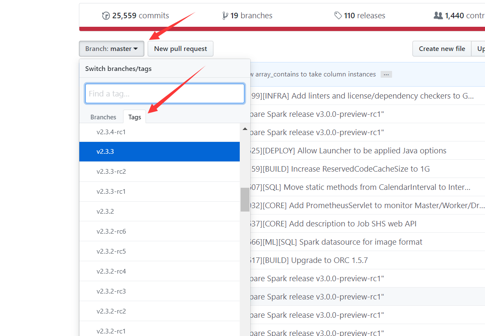
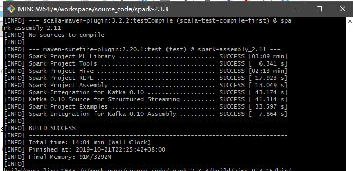
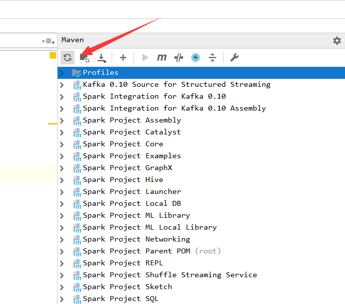

# 1. 下载spark源码，导入idea并进行编译

## 环境搭建
 - spark版本：**2.3.3**
 - jdk版本：**1.8**
 - maven版本：**3.3.9**
 - 开发工具：**idea**
 - scala版本：**2.11.8**

> 视频地址：https://www.bilibili.com/video/av72037856
> 欢迎点赞

### 1. 下载源码
下载与服务器上的spark版本相同的源码，地址：`https://github.com/apache/spark`


### 2. 解压后使用maven进行预编译
> 参考spark官网说明：http://spark.apache.org/docs/2.3.3/building-spark.html
#### 1. 设置参与编译时maven的内存资源
根据自己的电脑设置一下内存
> export MAVEN_OPTS="-Xmx4g -XX:ReservedCodeCacheSize=1024m"
#### 2. 使用gitbash进行预编译
一定要使用**gitbash**进行预编译

如不使用gitbash进行编译，可能会出现如下错误：

```
Failed to execute goal org.apache.maven.plugins:maven-antrun-plugin:1.8:run (default) on project spark-core_2.11: An Ant BuildException has occured: Execute fa
iled: java.io.IOException: Cannot run program "bash" (in directory "E:\workspace\source_code\spark-2.3.4\core"): CreateProcess error=2, 系统找不到指定的文件。
[ERROR] around Ant part ...<exec executable="bash">... @ 4:27 in E:\workspace\source_code\spark-2.3.4\core\target\antrun\build-main.xml
```

-T指**参与编译的线程数量**

> ./build/mvn -T 6 -DskipTests clean package

根据电脑配置，编译的时间长短不同，反正时间肯定不会短是真的


### 3. 使用IDEA导入源码
**open**  -> **选中源码根目录的pox.xml文件**-> **选择open as project进行导入**

### 4. 刷新maven

到这里源码就已经导入成功了


# 2. shell脚本的调试

## 2.1 start-master.sh脚本分析

#### 1. start-master.sh脚本内容

```
# 判断是否配置了SPARK_HOME，如果没有设置则先通过$0获取当前脚本的文件名
# 再通过dirname获取sbin目录，再cd回上级目录，pwd获取绝对路径，以此设置SPARK_HOME
if [ -z "${SPARK_HOME}" ]; then
  export SPARK_HOME="$(cd "`dirname "$0"`"/..; pwd)"
fi

# NOTE: This exact class name is matched downstream by SparkSubmit.
# Any changes need to be reflected there.

# 定义CLASS变量
CLASS="org.apache.spark.deploy.master.Master"

# 判断是否以--help或者-h结尾，如果是的话则打印出脚本使用方法
if [[ "$@" = *--help ]] || [[ "$@" = *-h ]]; then
  echo "Usage: ./sbin/start-master.sh [options]"
  pattern="Usage:"
  pattern+="\|Using Spark's default log4j profile:"
  pattern+="\|Registered signal handlers for"

  "${SPARK_HOME}"/bin/spark-class $CLASS --help 2>&1 | grep -v "$pattern" 1>&2
  exit 1
fi

# 通过$@取出所有参数，并将值赋值给ORIGINAL_ARGS
ORIGINAL_ARGS="$@"

# 通过.加上文件名临时执行spark-config.sh脚本
## 设置SPARK_HOME、SPARK_CONF_DIR以及python的一些环境变量
. "${SPARK_HOME}/sbin/spark-config.sh"

# 通过.加上文件名临时执行load-spark-env.sh脚本
## 设置SPARK_HOME、SPARK_SCALA_VERSION环境变量
. "${SPARK_HOME}/bin/load-spark-env.sh"

# 设置master的通信端口
if [ "$SPARK_MASTER_PORT" = "" ]; then
  SPARK_MASTER_PORT=7077
fi

# 设置master的主机地址
if [ "$SPARK_MASTER_HOST" = "" ]; then
  # 不同的操作系统使用不同的命令进行查看
  case `uname` in
      (SunOS)
	  SPARK_MASTER_HOST="`/usr/sbin/check-hostname | awk '{print $NF}'`"
	  ;;
      (*)
	  SPARK_MASTER_HOST="`hostname -f`"
	  ;;
  esac
fi

# 设置master ui端口
if [ "$SPARK_MASTER_WEBUI_PORT" = "" ]; then
  SPARK_MASTER_WEBUI_PORT=8080
fi

# 调用spark-daemon.sh脚本，传入master启动所需参数
"${SPARK_HOME}/sbin"/spark-daemon.sh start $CLASS 1 \
  --host $SPARK_MASTER_HOST --port $SPARK_MASTER_PORT --webui-port $SPARK_MASTER_WEBUI_PORT \
  $ORIGINAL_ARGS
```

#### 2. 执行 sh -x start-master.sh

```
# 判断是否配置了SPARK_HOME，如果没有设置则先通过$0获取当前脚本的文件名
# 再通过dirname获取sbin目录，再cd回上级目录，pwd获取绝对路径，以此设置SPARK_HOME
+ '[' -z /usr/local/spark ']'

# 定义CLASS变量
+ CLASS=org.apache.spark.deploy.master.Master

# 判断是否以--help或者-h结尾，如果是的话则打印出脚本使用方法
+ [[ '' = *--help ]]
+ [[ '' = *-h ]]

# 通过$@取出所有参数，并将值赋值给ORIGINAL_ARGS
+ ORIGINAL_ARGS=

# 通过.加上文件名临时执行spark-config.sh脚本
## 设置SPARK_HOME、SPARK_CONF_DIR以及python的一些环境变量
+ . /usr/local/spark/sbin/spark-config.sh
++ '[' -z /usr/local/spark ']'
++ export SPARK_CONF_DIR=/usr/local/spark/conf
++ SPARK_CONF_DIR=/usr/local/spark/conf
++ '[' -z '' ']'
++ export PYTHONPATH=/usr/local/spark/python:
++ PYTHONPATH=/usr/local/spark/python:
++ export PYTHONPATH=/usr/local/spark/python/lib/py4j-0.10.7-src.zip:/usr/local/spark/python:
++ PYTHONPATH=/usr/local/spark/python/lib/py4j-0.10.7-src.zip:/usr/local/spark/python:
++ export PYSPARK_PYTHONPATH_SET=1
++ PYSPARK_PYTHONPATH_SET=1

# 通过.加上文件名临时执行load-spark-env.sh脚本
## 设置SPARK_HOME、SPARK_SCALA_VERSION环境变量
+ . /usr/local/spark/bin/load-spark-env.sh
++ '[' -z /usr/local/spark ']'
++ '[' -z '' ']'
++ export SPARK_ENV_LOADED=1
++ SPARK_ENV_LOADED=1
++ export SPARK_CONF_DIR=/usr/local/spark/conf
++ SPARK_CONF_DIR=/usr/local/spark/conf
++ '[' -f /usr/local/spark/conf/spark-env.sh ']'
++ set -a
++ . /usr/local/spark/conf/spark-env.sh
+++ JAVA_HOME=/usr/local/jdk
+++ HADOOP_CONF_DIR=/usr/local/spark/hadoop/etc/hadoop
+++ SPARK_LOCAL_IP=s101
++ set +a
++ '[' -z '' ']'
++ ASSEMBLY_DIR2=/usr/local/spark/assembly/target/scala-2.11
++ ASSEMBLY_DIR1=/usr/local/spark/assembly/target/scala-2.12
++ [[ -d /usr/local/spark/assembly/target/scala-2.11 ]]
++ '[' -d /usr/local/spark/assembly/target/scala-2.11 ']'
++ export SPARK_SCALA_VERSION=2.12
++ SPARK_SCALA_VERSION=2.12


# 设置master的通信端口
+ '[' '' = '' ']'
+ SPARK_MASTER_PORT=7077

# 设置master的主机地址  
+ '[' '' = '' ']'
+ case `uname` in
# 不同的操作系统使用不同的命令进行查看
++ uname
++ hostname -f
+ SPARK_MASTER_HOST=s101

# 设置master ui端口
+ '[' '' = '' ']'
+ SPARK_MASTER_WEBUI_PORT=8080

# 调用spark-daemon.sh脚本，传入master启动所需参数：start org.apache.spark.deploy.master.Master 1 --host s101 --port 7077 --webui-port 8080

+ /usr/local/spark/sbin/spark-daemon.sh start org.apache.spark.deploy.master.Master 1 --host s101 --port 7077 --webui-port 8080
starting org.apache.spark.deploy.master.Master, logging to /usr/local/spark/logs/spark-hadoop-org.apache.spark.deploy.master.Master-1-s101.out
```

#### **3. start-master.sh调用spark-daemon.sh**

> sh -x /usr/local/spark/sbin/spark-daemon.sh start org.apache.spark.deploy.master.Master 1 --host s101 --port 7077 --webui-port 8080

------

#### 4. spark-daemon.sh脚本内容

```
usage="Usage: spark-daemon.sh [--config <conf-dir>] (start|stop|submit|status) <spark-command> <spark-instance-number> <args...>"

# 如果没有提供参数，则打印usage使用说明并中断脚本
if [ $# -le 1 ]; then
  echo $usage
  exit 1
fi

# 判断是否配置了SPARK_HOME，如果没有则手动设置
if [ -z "${SPARK_HOME}" ]; then
  export SPARK_HOME="$(cd "`dirname "$0"`"/..; pwd)"
fi

# 通过.加上文件名临时执行spark-config.sh脚本
## 设置SPARK_HOME、SPARK_CONF_DIR以及python的一些环境变量
. "${SPARK_HOME}/sbin/spark-config.sh"

# 检查参数中是否包含--config，如果该参数的值不为目录则退出
if [ "$1" == "--config" ]
then
  # 移除第一个参数
  shift
  conf_dir="$1"
  if [ ! -d "$conf_dir" ]
  then
    echo "ERROR : $conf_dir is not a directory"
    echo $usage
    exit 1
  else
    export SPARK_CONF_DIR="$conf_dir"
  fi
  shift
fi

# 分别对option、command、instance进行赋值
option=$1
shift
command=$1
shift
instance=$1
shift

spark_rotate_log ()
{
    log=$1;
    num=5;
    if [ -n "$2" ]; then
	num=$2
    fi
    if [ -f "$log" ]; then # rotate logs
	while [ $num -gt 1 ]; do
	    prev=`expr $num - 1`
	    [ -f "$log.$prev" ] && mv "$log.$prev" "$log.$num"
	    num=$prev
	done
	mv "$log" "$log.$num";
    fi
}


# 通过.加上文件名临时执行load-spark-env.sh脚本
## 设置SPARK_HOME、SPARK_SCALA_VERSION环境变量

. "${SPARK_HOME}/bin/load-spark-env.sh"

if [ "$SPARK_IDENT_STRING" = "" ]; then
  export SPARK_IDENT_STRING="$USER"
fi

# 设置SPARK_PRINT_LAUNCH_COMMAND环境变量
export SPARK_PRINT_LAUNCH_COMMAND="1"

# 日志相关
if [ "$SPARK_LOG_DIR" = "" ]; then
  export SPARK_LOG_DIR="${SPARK_HOME}/logs"
fi
mkdir -p "$SPARK_LOG_DIR"
touch "$SPARK_LOG_DIR"/.spark_test > /dev/null 2>&1
TEST_LOG_DIR=$?
if [ "${TEST_LOG_DIR}" = "0" ]; then
  rm -f "$SPARK_LOG_DIR"/.spark_test
else
  chown "$SPARK_IDENT_STRING" "$SPARK_LOG_DIR"
fi

# 设置spark进程目录
if [ "$SPARK_PID_DIR" = "" ]; then
  SPARK_PID_DIR=/tmp
fi

# 定义log和pid变量
log="$SPARK_LOG_DIR/spark-$SPARK_IDENT_STRING-$command-$instance-$HOSTNAME.out"
pid="$SPARK_PID_DIR/spark-$SPARK_IDENT_STRING-$command-$instance.pid"

# 设置默认的调度优先级
if [ "$SPARK_NICENESS" = "" ]; then
    export SPARK_NICENESS=0
fi

# 该方法
execute_command() {
  # 看不懂+set是啥意思...不过debug的时候会进这个条件判断
  if [ -z ${SPARK_NO_DAEMONIZE+set} ]; then
      # 后台执行脚本命令，此处是获取传入该方法的所有参数，进行运行
      nohup -- "$@" >> $log 2>&1 < /dev/null &
      # 获取最新的后台运行的pid，即上条命令所占用的pid
      newpid="$!"
		
      echo "$newpid" > "$pid"

      # 共等待5秒来等待上述程序的运行
      for i in {1..10}
      do
        if [[ $(ps -p "$newpid" -o comm=) =~ "java" ]]; then
           break
        fi
        sleep 0.5
      done
      
      # 再等待2秒
      sleep 2
      # 当程序正常运行时，打印日志
      if [[ ! $(ps -p "$newpid" -o comm=) =~ "java" ]]; then
        echo "failed to launch: $@"
        tail -2 "$log" | sed 's/^/  /'
        echo "full log in $log"
      fi
  else
      "$@"
  fi
}

# 该方法主要判断是否能继续进行，并做一些预处理
run_command() {
  # 获取第一个参数赋值给mode
  mode="$1"
  shift
  # 创建进程目录
  mkdir -p "$SPARK_PID_DIR"
  
  # 判断进程文件是否存在，如果存在则给出提示：进程已存在，请先停止
  if [ -f "$pid" ]; then
    TARGET_ID="$(cat "$pid")"
    if [[ $(ps -p "$TARGET_ID" -o comm=) =~ "java" ]]; then
      echo "$command running as process $TARGET_ID.  Stop it first."
      exit 1
    fi
  fi
  # 如果spark_master不为空，则在masters(master高可用的情况)中同步删除部分文件
  if [ "$SPARK_MASTER" != "" ]; then
    echo rsync from "$SPARK_MASTER"
    rsync -a -e ssh --delete --exclude=.svn --exclude='logs/*' --exclude='contrib/hod/logs/*' "$SPARK_MASTER/" "${SPARK_HOME}"
  fi

  spark_rotate_log "$log"
  echo "starting $command, logging to $log"

  # 使用mode变量进行匹配
  case "$mode" in
    (class)
      # 当变量为class时调用execute_command，传入参数
      execute_command nice -n "$SPARK_NICENESS" "${SPARK_HOME}"/bin/spark-class "$command" "$@"
      ;;

    (submit)
      # 当变量为submit时调用execute_command，传入参数
      execute_command nice -n "$SPARK_NICENESS" bash "${SPARK_HOME}"/bin/spark-submit --class "$command" "$@"
      ;;

    (*)
      echo "unknown mode: $mode"
      exit 1
      ;;
  esac

}

# 使用option变量进行匹配
case $option in
  # 如果变量为submit则执行run_command方法，并将submit作为第一个参数传入
  (submit)
    run_command submit "$@"
    ;;
  # 如果变量为start则执行run_command方法，并将start作为第一个参数传入
  (start)
    run_command class "$@"
    ;;
  # 如果变量为stop，则执行kill命令，并删除进程文件	
  (stop)

    if [ -f $pid ]; then
      TARGET_ID="$(cat "$pid")"
      if [[ $(ps -p "$TARGET_ID" -o comm=) =~ "java" ]]; then
        echo "stopping $command"
        kill "$TARGET_ID" && rm -f "$pid"
      else
        echo "no $command to stop"
      fi
    else
      echo "no $command to stop"
    fi
    ;;
  # 如果变量为status，则打印状态信息
  (status)

    if [ -f $pid ]; then
      TARGET_ID="$(cat "$pid")"
      if [[ $(ps -p "$TARGET_ID" -o comm=) =~ "java" ]]; then
        echo $command is running.
        exit 0
      else
        echo $pid file is present but $command not running
        exit 1
      fi
    else
      echo $command not running.
      exit 2
    fi
    ;;
  # 如果变量未匹配上上述情况，则打印脚本使用方法
  (*)
    echo $usage
    exit 1
    ;;

esac
```

#### 5. debug spark-daemon.sh脚本

> sh -x /usr/local/spark/sbin/spark-daemon.sh start org.apache.spark.deploy.master.Master 1 --host s101 --port 7077 --webui-port 8080

```
+ usage='Usage: spark-daemon.sh [--config <conf-dir>] (start|stop|submit|status) <spark-command> <spark-instance-number> <args...>'

# 如果没有提供参数，则打印usage使用说明并中断脚本
+ '[' 9 -le 1 ']'

# 判断是否配置了SPARK_HOME，如果没有则手动设置
+ '[' -z /usr/local/spark ']'

# 通过.加上文件名临时执行spark-config.sh脚本
## 设置SPARK_HOME、SPARK_CONF_DIR以及python的一些环境变量
+ . /usr/local/spark/sbin/spark-config.sh
++ '[' -z /usr/local/spark ']'
++ export SPARK_CONF_DIR=/usr/local/spark/conf
++ SPARK_CONF_DIR=/usr/local/spark/conf
++ '[' -z '' ']'
++ export PYTHONPATH=/usr/local/spark/python:
++ PYTHONPATH=/usr/local/spark/python:
++ export PYTHONPATH=/usr/local/spark/python/lib/py4j-0.10.7-src.zip:/usr/local/spark/python:
++ PYTHONPATH=/usr/local/spark/python/lib/py4j-0.10.7-src.zip:/usr/local/spark/python:
++ export PYSPARK_PYTHONPATH_SET=1
++ PYSPARK_PYTHONPATH_SET=1

# 检查参数中是否包含--config，如果该参数的值不为目录则退出
+ '[' start == --config ']'


# 分别对option、command、instance进行赋值
+ option=start
+ shift
+ command=org.apache.spark.deploy.master.Master
+ shift
+ instance=1
+ shift

# 通过.加上文件名临时执行load-spark-env.sh脚本
## 设置SPARK_HOME、SPARK_SCALA_VERSION环境变量
+ . /usr/local/spark/bin/load-spark-env.sh
++ '[' -z /usr/local/spark ']'
++ '[' -z '' ']'
++ export SPARK_ENV_LOADED=1
++ SPARK_ENV_LOADED=1
++ export SPARK_CONF_DIR=/usr/local/spark/conf
++ SPARK_CONF_DIR=/usr/local/spark/conf
++ '[' -f /usr/local/spark/conf/spark-env.sh ']'
++ set -a
++ . /usr/local/spark/conf/spark-env.sh
+++ JAVA_HOME=/usr/local/jdk
+++ HADOOP_CONF_DIR=/usr/local/spark/hadoop/etc/hadoop
+++ SPARK_LOCAL_IP=s101
++ set +a
++ '[' -z '' ']'
++ ASSEMBLY_DIR2=/usr/local/spark/assembly/target/scala-2.11
++ ASSEMBLY_DIR1=/usr/local/spark/assembly/target/scala-2.12
++ [[ -d /usr/local/spark/assembly/target/scala-2.11 ]]
++ '[' -d /usr/local/spark/assembly/target/scala-2.11 ']'
++ export SPARK_SCALA_VERSION=2.12
++ SPARK_SCALA_VERSION=2.12

+ '[' '' = '' ']'
+ export SPARK_IDENT_STRING=hadoop
+ SPARK_IDENT_STRING=hadoop

# 设置SPARK_PRINT_LAUNCH_COMMAND环境变量
+ export SPARK_PRINT_LAUNCH_COMMAND=1
+ SPARK_PRINT_LAUNCH_COMMAND=1

# 日志相关
+ '[' '' = '' ']'
+ export SPARK_LOG_DIR=/usr/local/spark/logs
+ SPARK_LOG_DIR=/usr/local/spark/logs
+ mkdir -p /usr/local/spark/logs
+ touch /usr/local/spark/logs/.spark_test
+ TEST_LOG_DIR=0
+ '[' 0 = 0 ']'
+ rm -f /usr/local/spark/logs/.spark_test
+ '[' '' = '' ']'

# 设置spark进程目录
+ SPARK_PID_DIR=/tmp


# 定义log和pid变量
+ log=/usr/local/spark/logs/spark-hadoop-org.apache.spark.deploy.master.Master-1-s101.out
+ pid=/tmp/spark-hadoop-org.apache.spark.deploy.master.Master-1.pid

# 设置默认的调度优先级
+ '[' '' = '' ']'
+ export SPARK_NICENESS=0
+ SPARK_NICENESS=0


# 使用option参数进行匹配，调用方法，传入不同的参数
+ case $option in
# 调用run_command方法，传入class参数以及上个脚本传入的参数
+ run_command class --host s101 --port 7077 --webui-port 8080


# run_command方法内容
+ mode=class
+ shift
# 创建进程目录
+ mkdir -p /tmp
# 判断进程文件是否存在，如果存在则给出提示：进程已存在，请先停止
+ '[' -f /tmp/spark-hadoop-org.apache.spark.deploy.master.Master-1.pid ']'
+ '[' '' '!=' '' ']'
+ spark_rotate_log /usr/local/spark/logs/spark-hadoop-org.apache.spark.deploy.master.Master-1-s101.out
+ log=/usr/local/spark/logs/spark-hadoop-org.apache.spark.deploy.master.Master-1-s101.out
+ num=5
+ '[' -n '' ']'
+ '[' -f /usr/local/spark/logs/spark-hadoop-org.apache.spark.deploy.master.Master-1-s101.out ']'
+ '[' 5 -gt 1 ']'
++ expr 5 - 1
+ prev=4
+ '[' -f /usr/local/spark/logs/spark-hadoop-org.apache.spark.deploy.master.Master-1-s101.out.4 ']'
+ mv /usr/local/spark/logs/spark-hadoop-org.apache.spark.deploy.master.Master-1-s101.out.4 /usr/local/spark/logs/spark-hadoop-org.apache.spark.deploy.master.Master-1-s101.out.5
+ num=4
+ '[' 4 -gt 1 ']'
++ expr 4 - 1
+ prev=3
+ '[' -f /usr/local/spark/logs/spark-hadoop-org.apache.spark.deploy.master.Master-1-s101.out.3 ']'
+ mv /usr/local/spark/logs/spark-hadoop-org.apache.spark.deploy.master.Master-1-s101.out.3 /usr/local/spark/logs/spark-hadoop-org.apache.spark.deploy.master.Master-1-s101.out.4
+ num=3
+ '[' 3 -gt 1 ']'
++ expr 3 - 1
+ prev=2
+ '[' -f /usr/local/spark/logs/spark-hadoop-org.apache.spark.deploy.master.Master-1-s101.out.2 ']'
+ mv /usr/local/spark/logs/spark-hadoop-org.apache.spark.deploy.master.Master-1-s101.out.2 /usr/local/spark/logs/spark-hadoop-org.apache.spark.deploy.master.Master-1-s101.out.3
+ num=2
+ '[' 2 -gt 1 ']'
++ expr 2 - 1
+ prev=1
+ '[' -f /usr/local/spark/logs/spark-hadoop-org.apache.spark.deploy.master.Master-1-s101.out.1 ']'
+ mv /usr/local/spark/logs/spark-hadoop-org.apache.spark.deploy.master.Master-1-s101.out.1 /usr/local/spark/logs/spark-hadoop-org.apache.spark.deploy.master.Master-1-s101.out.2
+ num=1
+ '[' 1 -gt 1 ']'
+ mv /usr/local/spark/logs/spark-hadoop-org.apache.spark.deploy.master.Master-1-s101.out /usr/local/spark/logs/spark-hadoop-org.apache.spark.deploy.master.Master-1-s101.out.1
+ echo 'starting org.apache.spark.deploy.master.Master, logging to /usr/local/spark/logs/spark-hadoop-org.apache.spark.deploy.master.Master-1-s101.out'
starting org.apache.spark.deploy.master.Master, logging to /usr/local/spark/logs/spark-hadoop-org.apache.spark.deploy.master.Master-1-s101.out

# 使用mode值:class进行匹配
+ case "$mode" in
# 调用execute_command方法
+ execute_command nice -n 0 /usr/local/spark/bin/spark-class org.apache.spark.deploy.master.Master --host s101 --port 7077 --webui-port 8080

#execute_command方法内容
+ '[' -z ']'
+ newpid=3150
+ echo 3150
+ for i in '{1..10}'
++ ps -p 3150 -o comm=

# 调用spark-class脚本
+ nohup -- nice -n 0 /usr/local/spark/bin/spark-class org.apache.spark.deploy.master.Master --host s101 --port 7077 --webui-port 8080
+ [[ bash =~ java ]]
+ sleep 0.5
+ for i in '{1..10}'
++ ps -p 3150 -o comm=
+ [[ java =~ java ]]
+ break
+ sleep 2
++ ps -p 3150 -o comm=
+ [[ ! java =~ java ]]
```

#### 5. spark-daemon.sh调用spark-class

> sh -x /usr/local/spark/bin/spark-class org.apache.spark.deploy.master.Master --host s101 --port 7077 --webui-port 8080

#### 6. spark-class内容

```
# 判断是否配置了SPARK_HOME，如果没有则手动设置
if [ -z "${SPARK_HOME}" ]; then
  source "$(dirname "$0")"/find-spark-home
fi

# 通过.加上文件名临时执行load-spark-env.sh脚本
## 设置SPARK_HOME、SPARK_SCALA_VERSION环境变量
. "${SPARK_HOME}"/bin/load-spark-env.sh

# 判断是否设置JAVA_HOME,获取java可执行文件的位置并赋值给RUNNER
if [ -n "${JAVA_HOME}" ]; then
  RUNNER="${JAVA_HOME}/bin/java"
else
  if [ "$(command -v java)" ]; then
    RUNNER="java"
  else
    echo "JAVA_HOME is not set" >&2
    exit 1
  fi
fi

# 获取spark的jar包的位置
if [ -d "${SPARK_HOME}/jars" ]; then
  SPARK_JARS_DIR="${SPARK_HOME}/jars"
else
  SPARK_JARS_DIR="${SPARK_HOME}/assembly/target/scala-$SPARK_SCALA_VERSION/jars"
fi

if [ ! -d "$SPARK_JARS_DIR" ] && [ -z "$SPARK_TESTING$SPARK_SQL_TESTING" ]; then
  echo "Failed to find Spark jars directory ($SPARK_JARS_DIR)." 1>&2
  echo "You need to build Spark with the target \"package\" before running this program." 1>&2
  exit 1
else
  LAUNCH_CLASSPATH="$SPARK_JARS_DIR/*"
fi

# Add the launcher build dir to the classpath if requested.
if [ -n "$SPARK_PREPEND_CLASSES" ]; then
  LAUNCH_CLASSPATH="${SPARK_HOME}/launcher/target/scala-$SPARK_SCALA_VERSION/classes:$LAUNCH_CLASSPATH"
fi

# For tests
if [[ -n "$SPARK_TESTING" ]]; then
  unset YARN_CONF_DIR
  unset HADOOP_CONF_DIR
fi

# 组装参数并打印
build_command() {
  "$RUNNER" -Xmx128m -cp "$LAUNCH_CLASSPATH" org.apache.spark.launcher.Main "$@"
  printf "%d\0" $?
}

# 看不懂
set +o posix
CMD=()
# 读取变量
while IFS= read -d '' -r ARG; do
  CMD+=("$ARG")
# 组装数据  
done < <(build_command "$@")

COUNT=${#CMD[@]}
LAST=$((COUNT - 1))
LAUNCHER_EXIT_CODE=${CMD[$LAST]}

# Certain JVM failures result in errors being printed to stdout (instead of stderr), which causes
# the code that parses the output of the launcher to get confused. In those cases, check if the
# exit code is an integer, and if it's not, handle it as a special error case.
if ! [[ $LAUNCHER_EXIT_CODE =~ ^[0-9]+$ ]]; then
  echo "${CMD[@]}" | head -n-1 1>&2
  exit 1
fi

if [ $LAUNCHER_EXIT_CODE != 0 ]; then
  exit $LAUNCHER_EXIT_CODE
fi

# 执行最终命令
CMD=("${CMD[@]:0:$LAST}")
exec "${CMD[@]}"
```

#### 7. debug spark-class脚本

> sh -x /usr/local/spark/bin/spark-class org.apache.spark.deploy.master.Master --host s101 --port 7077 --webui-port 8080

```
# 判断是否配置了SPARK_HOME，如果没有则手动设置
+ '[' -z /usr/local/spark ']'

# 通过.加上文件名临时执行load-spark-env.sh脚本
## 设置SPARK_HOME、SPARK_SCALA_VERSION环境变量
+ . /usr/local/spark/bin/load-spark-env.sh
++ '[' -z /usr/local/spark ']'
++ '[' -z '' ']'
++ export SPARK_ENV_LOADED=1
++ SPARK_ENV_LOADED=1
++ export SPARK_CONF_DIR=/usr/local/spark/conf
++ SPARK_CONF_DIR=/usr/local/spark/conf
++ '[' -f /usr/local/spark/conf/spark-env.sh ']'
++ set -a
++ . /usr/local/spark/conf/spark-env.sh
+++ JAVA_HOME=/usr/local/jdk
+++ HADOOP_CONF_DIR=/usr/local/spark/hadoop/etc/hadoop
+++ SPARK_LOCAL_IP=s101
++ set +a
++ '[' -z '' ']'
++ ASSEMBLY_DIR2=/usr/local/spark/assembly/target/scala-2.11
++ ASSEMBLY_DIR1=/usr/local/spark/assembly/target/scala-2.12
++ [[ -d /usr/local/spark/assembly/target/scala-2.11 ]]
++ '[' -d /usr/local/spark/assembly/target/scala-2.11 ']'
++ export SPARK_SCALA_VERSION=2.12
++ SPARK_SCALA_VERSION=2.12

# 判断是否设置JAVA_HOME,获取java可执行文件的位置并赋值给RUNNER
+ '[' -n /usr/local/jdk ']'
+ RUNNER=/usr/local/jdk/bin/java

# 获取spark的jar包的位置
+ '[' -d /usr/local/spark/jars ']'
+ SPARK_JARS_DIR=/usr/local/spark/jars
+ '[' '!' -d /usr/local/spark/jars ']'
+ LAUNCH_CLASSPATH='/usr/local/spark/jars/*'
+ '[' -n '' ']'
+ [[ -n '' ]]
+ set +o posix
+ CMD=()
+ IFS=
+ read -d '' -r ARG

# 组装参数并打印
++ build_command org.apache.spark.deploy.master.Master --host s101 --port 7077 --webui-port 8080
++ /usr/local/jdk/bin/java -Xmx128m -cp '/usr/local/spark/jars/*' org.apache.spark.launcher.Main org.apache.spark.deploy.master.Master --host s101 --port 7077 --webui-port 8080
+ CMD+=("$ARG")
+ IFS=
+ read -d '' -r ARG
+ CMD+=("$ARG")
+ IFS=
+ read -d '' -r ARG
+ CMD+=("$ARG")
+ IFS=
+ read -d '' -r ARG
+ CMD+=("$ARG")
+ IFS=
+ read -d '' -r ARG
+ CMD+=("$ARG")
+ IFS=
+ read -d '' -r ARG
+ CMD+=("$ARG")
+ IFS=
+ read -d '' -r ARG
+ CMD+=("$ARG")
+ IFS=
+ read -d '' -r ARG
+ CMD+=("$ARG")
+ IFS=
+ read -d '' -r ARG
+ CMD+=("$ARG")
+ IFS=
+ read -d '' -r ARG
+ CMD+=("$ARG")
+ IFS=
+ read -d '' -r ARG
+ CMD+=("$ARG")
+ IFS=
+ read -d '' -r ARG
++ printf '%d\0' 0
+ CMD+=("$ARG")
+ IFS=
+ read -d '' -r ARG
+ COUNT=12
+ LAST=11
+ LAUNCHER_EXIT_CODE=0
+ [[ 0 =~ ^[0-9]+$ ]]
+ '[' 0 '!=' 0 ']'
+ CMD=("${CMD[@]:0:$LAST}")

# 执行最终命令
# 通过java -cp命令执行Master的main方法
+ exec /usr/local/jdk/bin/java -cp '/usr/local/spark/conf/:/usr/local/spark/jars/*:/usr/local/spark/hadoop/etc/hadoop' -Xmx1g org.apache.spark.deploy.master.Master --host s101 --port 7077 --webui-port 8080
2019-10-19 19:32:23 INFO  Master:2612 - Started daemon with process name: 3462@s101
2019-10-19 19:32:23 INFO  SignalUtils:54 - Registered signal handler for TERM
2019-10-19 19:32:23 INFO  SignalUtils:54 - Registered signal handler for HUP
2019-10-19 19:32:23 INFO  SignalUtils:54 - Registered signal handler for INT
2019-10-19 19:32:24 WARN  NativeCodeLoader:62 - Unable to load native-hadoop library for your platform... using builtin-java classes where applicable
2019-10-19 19:32:24 INFO  SecurityManager:54 - Changing view acls to: hadoop
2019-10-19 19:32:24 INFO  SecurityManager:54 - Changing modify acls to: hadoop
2019-10-19 19:32:24 INFO  SecurityManager:54 - Changing view acls groups to: 
2019-10-19 19:32:24 INFO  SecurityManager:54 - Changing modify acls groups to: 
2019-10-19 19:32:24 INFO  SecurityManager:54 - SecurityManager: authentication disabled; ui acls disabled; users  with view permissions: Set(hadoop); groups with view permissions: Set(); users  with modify permissions: Set(hadoop); groups with modify permissions: Set()
2019-10-19 19:32:25 INFO  Utils:54 - Successfully started service 'sparkMaster' on port 7077.
2019-10-19 19:32:25 INFO  Master:54 - Starting Spark master at spark://s101:7077
2019-10-19 19:32:25 INFO  Master:54 - Running Spark version 2.3.3
2019-10-19 19:32:25 INFO  log:192 - Logging initialized @2751ms
2019-10-19 19:32:25 INFO  Server:351 - jetty-9.3.z-SNAPSHOT, build timestamp: unknown, git hash: unknown
2019-10-19 19:32:25 INFO  Server:419 - Started @2854ms
2019-10-19 19:32:25 INFO  AbstractConnector:278 - Started ServerConnector@6697ccfc{HTTP/1.1,[http/1.1]}{s101:8080}
2019-10-19 19:32:25 INFO  Utils:54 - Successfully started service 'MasterUI' on port 8080.
2019-10-19 19:32:25 INFO  ContextHandler:781 - Started o.s.j.s.ServletContextHandler@4ca5f5d4{/app,null,AVAILABLE,@Spark}
2019-10-19 19:32:25 INFO  ContextHandler:781 - Started o.s.j.s.ServletContextHandler@612dad9d{/app/json,null,AVAILABLE,@Spark}
2019-10-19 19:32:25 INFO  ContextHandler:781 - Started o.s.j.s.ServletContextHandler@2d33ea4b{/,null,AVAILABLE,@Spark}
2019-10-19 19:32:25 INFO  ContextHandler:781 - Started o.s.j.s.ServletContextHandler@571bbd69{/json,null,AVAILABLE,@Spark}
2019-10-19 19:32:25 INFO  ContextHandler:781 - Started o.s.j.s.ServletContextHandler@5bd6b352{/static,null,AVAILABLE,@Spark}
2019-10-19 19:32:25 INFO  ContextHandler:781 - Started o.s.j.s.ServletContextHandler@27e45fee{/app/kill,null,AVAILABLE,@Spark}
2019-10-19 19:32:25 INFO  ContextHandler:781 - Started o.s.j.s.ServletContextHandler@702f3bde{/driver/kill,null,AVAILABLE,@Spark}
2019-10-19 19:32:25 INFO  MasterWebUI:54 - Bound MasterWebUI to s101, and started at http://s101:8080
2019-10-19 19:32:25 INFO  Server:351 - jetty-9.3.z-SNAPSHOT, build timestamp: unknown, git hash: unknown
2019-10-19 19:32:25 INFO  ContextHandler:781 - Started o.s.j.s.ServletContextHandler@58a371ed{/,null,AVAILABLE}
2019-10-19 19:32:25 INFO  AbstractConnector:278 - Started ServerConnector@6753d65d{HTTP/1.1,[http/1.1]}{s101:6066}
2019-10-19 19:32:25 INFO  Server:419 - Started @3096ms
2019-10-19 19:32:25 INFO  Utils:54 - Successfully started service on port 6066.
2019-10-19 19:32:25 INFO  StandaloneRestServer:54 - Started REST server for submitting applications on port 6066
2019-10-19 19:32:25 INFO  ContextHandler:781 - Started o.s.j.s.ServletContextHandler@68302393{/metrics/master/json,null,AVAILABLE,@Spark}
2019-10-19 19:32:25 INFO  ContextHandler:781 - Started o.s.j.s.ServletContextHandler@6882ec3{/metrics/applications/json,null,AVAILABLE,@Spark}
2019-10-19 19:32:26 INFO  Master:54 - I have been elected leader! New state: ALIVE
```

#### 8. 执行org.apache.spark.deploy.master.Master中的内容

```
/usr/local/jdk/bin/java -cp '/usr/local/spark/conf/:/usr/local/spark/jars/*:/usr/local/spark/hadoop/etc/hadoop' -Xmx1g org.apache.spark.deploy.master.Master --host s101 --port 7077 --webui-port 8080
```

#### 9. Master解析

##### 1. Master执行内容(main方法)

```scala
def main(argStrings: Array[String]) {
    // 设置处理未被捕获的异常处理器
    Thread.setDefaultUncaughtExceptionHandler(new SparkUncaughtExceptionHandler(
      exitOnUncaughtException = false))
    Utils.initDaemon(log)
    val conf = new SparkConf
    // 解析参数，并为sparkConf设置默认参数(默认的参数来自于$SPARK_HOME/conf/spark-defaults.con文件)
    val args = new MasterArguments(argStrings, conf)
    // 创建RpcEnv并启动RpcEndpoint
    val (rpcEnv, _, _) = startRpcEnvAndEndpoint(args.host, args.port, args.webUiPort, conf)
    rpcEnv.awaitTermination()
}
```

##### **2. startRpcEnvAndEndpoint方法：**

- **RpcEndpoint：**可以理解为一个rpc终端，可以收发消息，并可以在启动、接收消息、停止的时间点进行自定义的逻辑处理，**线程不安全**

- **RpcEndpointRef：**RpcEndpoint的一个引用，**线程安全**

****

```scala
def startRpcEnvAndEndpoint(host: String, port: Int, webUiPort: Int, conf: SparkConf): (RpcEnv, Int, Option[Int]) = {
    // 创建一个**SecurityManager**、**RpcEnv**，为创建RpcEndPoint做准备
	val securityMgr = new SecurityManager(conf)
	val rpcEnv = RpcEnv.create(SYSTEM_NAME, host, port, conf, securityMgr)
    // 调用org.apache.spark.rpc.netty.NettyRpcEnv#setupEndpoint方法进行NettyRpcEndpointRef的创建
	val masterEndpoint = rpcEnv.setupEndpoint(ENDPOINT_NAME,
	  new Master(rpcEnv, rpcEnv.address, webUiPort, securityMgr, conf))
    
    // 该方法是以同步的方式向masterEndpoint发送一个BoundPortsRequest消息，在接收到返回值之前会一直阻塞,master消息处理逻辑在onstart()方法内
    // 返回数据为BoundPortsResponse:(rpcEndpointPort: Int, webUIPort: Int, restPort: Option[Int])
	val portsResponse = masterEndpoint.askSync[BoundPortsResponse](BoundPortsRequest)
	(rpcEnv, portsResponse.webUIPort, portsResponse.restPort)
}
```

##### 3. setupEndpoint调用dispatcher.registerRpcEndpoint(name, endpoint)方法

```scala
def registerRpcEndpoint(name: String, endpoint: RpcEndpoint): NettyRpcEndpointRef = {
    // 创建一个RpcEndpointAddress对象，即master节点的prc地址，name
    val addr = RpcEndpointAddress(nettyEnv.address, name)
    // 创建RpcEndpointRef作为后续使用
    val endpointRef = new NettyRpcEndpointRef(nettyEnv.conf, addr, nettyEnv)
    synchronized {
      if (stopped) {
        throw new IllegalStateException("RpcEnv has been stopped")
      }
      if (endpoints.putIfAbsent(name, new EndpointData(name, endpoint, endpointRef)) != null) {
        throw new IllegalArgumentException(s"There is already an RpcEndpoint called $name")
      }
      val data = endpoints.get(name)
      endpointRefs.put(data.endpoint, data.ref)
      receivers.offer(data)  // for the OnStart message
    }
    endpointRef
}
```

##### 4. Master中重写RpcEndpoint中的方法

1. ###### onstart()

   > 方法说明：Invoked before [[RpcEndpoint]] starts to handle any message
   >
   > ​					在处理消息之前进行调用
   >
   > 调用时机：
   >
   > org.apache.spark.deploy.master.Master#startRpcEnvAndEndpoint方法：
   >
   > val portsResponse = masterEndpoint.askSync[BoundPortsResponse\](BoundPortsRequest)
   >
   > 该方法是以同步的方式向masterEndpoint发送一个BoundPortsRequest消息，在接收到返回值之前会一直阻塞

   1. 根据给定的ui端口启动一个MasterWebUI(可根据**spark.ui.reverseProxy**设置ui代理)
   2. 启动一个后台线程(**newDaemonSingleThreadScheduledExecutor**)，默认每分钟对worker进行检测
   3. spark-rest任务提交端口设置：**spark.master.rest.port**： **6066(默认)**，仅在**standalone**或者**cluster**模式有效
   4. 监控系统的注册与启动
   5. 根据recovery_mode创建持久化引擎和leader

2. ###### receive(仅讨论接收到worker注册数据的逻辑处理)

   1. 如果接收到worker的注册信息，将收到的信息组装为**WorkerInfo**，并进行注册

      1. 先删除与当前**worker**的**host**、**port**相等的并且状态为**dead**的已注册的worker

         > ```
         > 从HashSet[WorkerInfo]删除
         > ```

      2. 判断该rpc地址是否已经注册，如果已注册，并且该worker的state为**unknown**，则将之前的workerInfo移除

         > ```
         > addressToWorker = new HashMap[RpcAddress, WorkerInfo]
         > removeWorker(oldWorker, "Worker replaced by a new worker with same address")
         > ```

      3. 进行注册

         ```scala
         workers = new HashSet[WorkerInfo] += worker
         idToWorker(worker.id) = new HashMap[String, WorkerInfo] = worker
         addressToWorker(workerAddress) = new HashMap[RpcAddress, WorkerInfo] = worker
         ```
      
      4. 将worker加入持久化引擎

      5. 向worker发送数据

         > RegisteredWorker(self, masterWebUiUrl, masterAddress)
   
      6. 调用**schedule()**方法，该方法会在每次有新的application加入或者可用的资源刷新的时候调用，主要作用是调整可用的资源

### 2. 调试start-slaves.sh

#### 1. 执行start-slaves.sh文件

> sh -x start-slaves.sh

```
+ '[' -z /usr/local/spark ']'


+ . /usr/local/spark/sbin/spark-config.sh
++ '[' -z /usr/local/spark ']'
++ export SPARK_CONF_DIR=/usr/local/spark/conf
++ SPARK_CONF_DIR=/usr/local/spark/conf
++ '[' -z '' ']'
++ export PYTHONPATH=/usr/local/spark/python:
++ PYTHONPATH=/usr/local/spark/python:
++ export PYTHONPATH=/usr/local/spark/python/lib/py4j-0.10.7-src.zip:/usr/local/spark/python:
++ PYTHONPATH=/usr/local/spark/python/lib/py4j-0.10.7-src.zip:/usr/local/spark/python:
++ export PYSPARK_PYTHONPATH_SET=1
++ PYSPARK_PYTHONPATH_SET=1


+ . /usr/local/spark/bin/load-spark-env.sh
++ '[' -z /usr/local/spark ']'
++ '[' -z '' ']'
++ export SPARK_ENV_LOADED=1
++ SPARK_ENV_LOADED=1
++ export SPARK_CONF_DIR=/usr/local/spark/conf
++ SPARK_CONF_DIR=/usr/local/spark/conf
++ '[' -f /usr/local/spark/conf/spark-env.sh ']'
++ set -a
++ . /usr/local/spark/conf/spark-env.sh
+++ JAVA_HOME=/usr/local/jdk
+++ HADOOP_CONF_DIR=/usr/local/spark/hadoop/etc/hadoop
+++ SPARK_LOCAL_IP=s101
++ set +a
++ '[' -z '' ']'
++ ASSEMBLY_DIR2=/usr/local/spark/assembly/target/scala-2.11
++ ASSEMBLY_DIR1=/usr/local/spark/assembly/target/scala-2.12
++ [[ -d /usr/local/spark/assembly/target/scala-2.11 ]]
++ '[' -d /usr/local/spark/assembly/target/scala-2.11 ']'
++ export SPARK_SCALA_VERSION=2.12
++ SPARK_SCALA_VERSION=2.12


+ '[' '' = '' ']'
+ SPARK_MASTER_PORT=7077


+ '[' '' = '' ']'
+ case `uname` in
++ uname
++ hostname -f
+ SPARK_MASTER_HOST=s101


+ /usr/local/spark/sbin/slaves.sh cd /usr/local/spark ';' 

# 调用spark-slave.sh文件
/usr/local/spark/sbin/start-slave.sh spark://s101:7077


s101: starting org.apache.spark.deploy.worker.Worker, logging to /usr/local/spark/logs/spark-hadoop-org.apache.spark.deploy.worker.Worker-1-s101.out
```

#### 2. start-slaves.sh调用start-slave.sh

> /usr/local/spark/sbin/start-slave.sh spark://s101:7077

#### 3. 执行start-slave.sh

> sh -x /usr/local/spark/sbin/start-slave.sh spark://s101:7077

```
+ '[' -z /usr/local/spark ']'


+ CLASS=org.apache.spark.deploy.worker.Worker


+ [[ 1 -lt 1 ]]
+ [[ spark://s101:7077 = *--help ]]
+ [[ spark://s101:7077 = *-h ]]
+ . /usr/local/spark/sbin/spark-config.sh
++ '[' -z /usr/local/spark ']'
++ export SPARK_CONF_DIR=/usr/local/spark/conf
++ SPARK_CONF_DIR=/usr/local/spark/conf
++ '[' -z '' ']'
++ export PYTHONPATH=/usr/local/spark/python:
++ PYTHONPATH=/usr/local/spark/python:
++ export PYTHONPATH=/usr/local/spark/python/lib/py4j-0.10.7-src.zip:/usr/local/spark/python:
++ PYTHONPATH=/usr/local/spark/python/lib/py4j-0.10.7-src.zip:/usr/local/spark/python:
++ export PYSPARK_PYTHONPATH_SET=1
++ PYSPARK_PYTHONPATH_SET=1
+ . /usr/local/spark/bin/load-spark-env.sh
++ '[' -z /usr/local/spark ']'
++ '[' -z '' ']'
++ export SPARK_ENV_LOADED=1
++ SPARK_ENV_LOADED=1
++ export SPARK_CONF_DIR=/usr/local/spark/conf
++ SPARK_CONF_DIR=/usr/local/spark/conf
++ '[' -f /usr/local/spark/conf/spark-env.sh ']'
++ set -a
++ . /usr/local/spark/conf/spark-env.sh
+++ JAVA_HOME=/usr/local/jdk
+++ HADOOP_CONF_DIR=/usr/local/spark/hadoop/etc/hadoop
+++ SPARK_LOCAL_IP=s101
++ set +a
++ '[' -z '' ']'
++ ASSEMBLY_DIR2=/usr/local/spark/assembly/target/scala-2.11
++ ASSEMBLY_DIR1=/usr/local/spark/assembly/target/scala-2.12
++ [[ -d /usr/local/spark/assembly/target/scala-2.11 ]]
++ '[' -d /usr/local/spark/assembly/target/scala-2.11 ']'
++ export SPARK_SCALA_VERSION=2.12
++ SPARK_SCALA_VERSION=2.12


+ MASTER=spark://s101:7077
+ shift


+ '[' '' = '' ']'
+ SPARK_WORKER_WEBUI_PORT=8081


+ '[' '' = '' ']'
+ start_instance 1
+ WORKER_NUM=1
+ shift
+ '[' '' = '' ']'
+ PORT_FLAG=
+ PORT_NUM=
+ WEBUI_PORT=8081

+ /usr/local/spark/sbin/spark-daemon.sh start org.apache.spark.deploy.worker.Worker 1 --webui-port 8081 spark://s101:7077
starting org.apache.spark.deploy.worker.Worker, logging to /usr/local/spark/logs/spark-hadoop-org.apache.spark.deploy.worker.Worker-1-s101.out
```

#### 4. start-slave.sh调用spark-daemon.sh

>  /usr/local/spark/sbin/spark-daemon.sh start org.apache.spark.deploy.worker.Worker 1 --webui-port 8081 spark://s101:7077

#### 5. 执行spark-daemon.sh

> sh -x /usr/local/spark/sbin/spark-daemon.sh start org.apache.spark.deploy.worker.Worker 1 --webui-port 8081 spark://s101:7077

```
+ usage='Usage: spark-daemon.sh [--config <conf-dir>] (start|stop|submit|status) <spark-command> <spark-instance-number> <args...>'
+ '[' 6 -le 1 ']'
+ '[' -z /usr/local/spark ']'
+ . /usr/local/spark/sbin/spark-config.sh
++ '[' -z /usr/local/spark ']'
++ export SPARK_CONF_DIR=/usr/local/spark/conf
++ SPARK_CONF_DIR=/usr/local/spark/conf
++ '[' -z '' ']'
++ export PYTHONPATH=/usr/local/spark/python:
++ PYTHONPATH=/usr/local/spark/python:
++ export PYTHONPATH=/usr/local/spark/python/lib/py4j-0.10.7-src.zip:/usr/local/spark/python:
++ PYTHONPATH=/usr/local/spark/python/lib/py4j-0.10.7-src.zip:/usr/local/spark/python:
++ export PYSPARK_PYTHONPATH_SET=1
++ PYSPARK_PYTHONPATH_SET=1
+ '[' start == --config ']'
+ option=start
+ shift
+ command=org.apache.spark.deploy.worker.Worker
+ shift
+ instance=1
+ shift
+ . /usr/local/spark/bin/load-spark-env.sh
++ '[' -z /usr/local/spark ']'
++ '[' -z '' ']'
++ export SPARK_ENV_LOADED=1
++ SPARK_ENV_LOADED=1
++ export SPARK_CONF_DIR=/usr/local/spark/conf
++ SPARK_CONF_DIR=/usr/local/spark/conf
++ '[' -f /usr/local/spark/conf/spark-env.sh ']'
++ set -a
++ . /usr/local/spark/conf/spark-env.sh
+++ JAVA_HOME=/usr/local/jdk
+++ HADOOP_CONF_DIR=/usr/local/spark/hadoop/etc/hadoop
+++ SPARK_LOCAL_IP=s101
++ set +a
++ '[' -z '' ']'
++ ASSEMBLY_DIR2=/usr/local/spark/assembly/target/scala-2.11
++ ASSEMBLY_DIR1=/usr/local/spark/assembly/target/scala-2.12
++ [[ -d /usr/local/spark/assembly/target/scala-2.11 ]]
++ '[' -d /usr/local/spark/assembly/target/scala-2.11 ']'
++ export SPARK_SCALA_VERSION=2.12
++ SPARK_SCALA_VERSION=2.12
+ '[' '' = '' ']'
+ export SPARK_IDENT_STRING=hadoop
+ SPARK_IDENT_STRING=hadoop
+ export SPARK_PRINT_LAUNCH_COMMAND=1
+ SPARK_PRINT_LAUNCH_COMMAND=1
+ '[' '' = '' ']'
+ export SPARK_LOG_DIR=/usr/local/spark/logs
+ SPARK_LOG_DIR=/usr/local/spark/logs
+ mkdir -p /usr/local/spark/logs
+ touch /usr/local/spark/logs/.spark_test
+ TEST_LOG_DIR=0
+ '[' 0 = 0 ']'
+ rm -f /usr/local/spark/logs/.spark_test
+ '[' '' = '' ']'
+ SPARK_PID_DIR=/tmp
+ log=/usr/local/spark/logs/spark-hadoop-org.apache.spark.deploy.worker.Worker-1-s101.out
+ pid=/tmp/spark-hadoop-org.apache.spark.deploy.worker.Worker-1.pid
+ '[' '' = '' ']'
+ export SPARK_NICENESS=0
+ SPARK_NICENESS=0
+ case $option in
+ run_command class --webui-port 8081 spark://s101:7077
+ mode=class
+ shift
+ mkdir -p /tmp
+ '[' -f /tmp/spark-hadoop-org.apache.spark.deploy.worker.Worker-1.pid ']'
+ '[' '' '!=' '' ']'
+ spark_rotate_log /usr/local/spark/logs/spark-hadoop-org.apache.spark.deploy.worker.Worker-1-s101.out
+ log=/usr/local/spark/logs/spark-hadoop-org.apache.spark.deploy.worker.Worker-1-s101.out
+ num=5
+ '[' -n '' ']'
+ '[' -f /usr/local/spark/logs/spark-hadoop-org.apache.spark.deploy.worker.Worker-1-s101.out ']'
+ '[' 5 -gt 1 ']'
++ expr 5 - 1
+ prev=4
+ '[' -f /usr/local/spark/logs/spark-hadoop-org.apache.spark.deploy.worker.Worker-1-s101.out.4 ']'
+ mv /usr/local/spark/logs/spark-hadoop-org.apache.spark.deploy.worker.Worker-1-s101.out.4 /usr/local/spark/logs/spark-hadoop-org.apache.spark.deploy.worker.Worker-1-s101.out.5
+ num=4
+ '[' 4 -gt 1 ']'
++ expr 4 - 1
+ prev=3
+ '[' -f /usr/local/spark/logs/spark-hadoop-org.apache.spark.deploy.worker.Worker-1-s101.out.3 ']'
+ mv /usr/local/spark/logs/spark-hadoop-org.apache.spark.deploy.worker.Worker-1-s101.out.3 /usr/local/spark/logs/spark-hadoop-org.apache.spark.deploy.worker.Worker-1-s101.out.4
+ num=3
+ '[' 3 -gt 1 ']'
++ expr 3 - 1
+ prev=2
+ '[' -f /usr/local/spark/logs/spark-hadoop-org.apache.spark.deploy.worker.Worker-1-s101.out.2 ']'
+ mv /usr/local/spark/logs/spark-hadoop-org.apache.spark.deploy.worker.Worker-1-s101.out.2 /usr/local/spark/logs/spark-hadoop-org.apache.spark.deploy.worker.Worker-1-s101.out.3
+ num=2
+ '[' 2 -gt 1 ']'
++ expr 2 - 1
+ prev=1
+ '[' -f /usr/local/spark/logs/spark-hadoop-org.apache.spark.deploy.worker.Worker-1-s101.out.1 ']'
+ mv /usr/local/spark/logs/spark-hadoop-org.apache.spark.deploy.worker.Worker-1-s101.out.1 /usr/local/spark/logs/spark-hadoop-org.apache.spark.deploy.worker.Worker-1-s101.out.2
+ num=1
+ '[' 1 -gt 1 ']'
+ mv /usr/local/spark/logs/spark-hadoop-org.apache.spark.deploy.worker.Worker-1-s101.out /usr/local/spark/logs/spark-hadoop-org.apache.spark.deploy.worker.Worker-1-s101.out.1
+ echo 'starting org.apache.spark.deploy.worker.Worker, logging to /usr/local/spark/logs/spark-hadoop-org.apache.spark.deploy.worker.Worker-1-s101.out'
starting org.apache.spark.deploy.worker.Worker, logging to /usr/local/spark/logs/spark-hadoop-org.apache.spark.deploy.worker.Worker-1-s101.out
+ case "$mode" in


+ execute_command nice -n 0 /usr/local/spark/bin/spark-class org.apache.spark.deploy.worker.Worker --webui-port 8081 spark://s101:7077
+ '[' -z ']'
+ newpid=15002
+ echo 15002
+ for i in '{1..10}'
++ ps -p 15002 -o comm=
+ nohup -- nice -n 0 /usr/local/spark/bin/spark-class org.apache.spark.deploy.worker.Worker --webui-port 8081 spark://s101:7077
+ [[ bash =~ java ]]
+ sleep 0.5
+ for i in '{1..10}'
++ ps -p 15002 -o comm=
+ [[ java =~ java ]]
+ break
+ sleep 2
++ ps -p 15002 -o comm=
+ [[ ! java =~ java ]]
```

#### 6. spark-daemon.sh调用spark-class

> /usr/local/spark/bin/spark-class org.apache.spark.deploy.worker.Worker --webui-port 8081 spark://s101:7077

#### 7. 执行spark-class

> sh -x /usr/local/spark/bin/spark-class org.apache.spark.deploy.worker.Worker --webui-port 8081 spark://s101:7077

```
+ '[' -z /usr/local/spark ']'
+ . /usr/local/spark/bin/load-spark-env.sh
++ '[' -z /usr/local/spark ']'
++ '[' -z '' ']'
++ export SPARK_ENV_LOADED=1
++ SPARK_ENV_LOADED=1
++ export SPARK_CONF_DIR=/usr/local/spark/conf
++ SPARK_CONF_DIR=/usr/local/spark/conf
++ '[' -f /usr/local/spark/conf/spark-env.sh ']'
++ set -a
++ . /usr/local/spark/conf/spark-env.sh
+++ JAVA_HOME=/usr/local/jdk
+++ HADOOP_CONF_DIR=/usr/local/spark/hadoop/etc/hadoop
+++ SPARK_LOCAL_IP=s101
++ set +a
++ '[' -z '' ']'
++ ASSEMBLY_DIR2=/usr/local/spark/assembly/target/scala-2.11
++ ASSEMBLY_DIR1=/usr/local/spark/assembly/target/scala-2.12
++ [[ -d /usr/local/spark/assembly/target/scala-2.11 ]]
++ '[' -d /usr/local/spark/assembly/target/scala-2.11 ']'
++ export SPARK_SCALA_VERSION=2.12
++ SPARK_SCALA_VERSION=2.12
+ '[' -n /usr/local/jdk ']'
+ RUNNER=/usr/local/jdk/bin/java
+ '[' -d /usr/local/spark/jars ']'
+ SPARK_JARS_DIR=/usr/local/spark/jars
+ '[' '!' -d /usr/local/spark/jars ']'
+ LAUNCH_CLASSPATH='/usr/local/spark/jars/*'
+ '[' -n '' ']'
+ [[ -n '' ]]
+ set +o posix
+ CMD=()
+ IFS=
+ read -d '' -r ARG
++ build_command org.apache.spark.deploy.worker.Worker --webui-port 8081 spark://s101:7077
++ /usr/local/jdk/bin/java -Xmx128m -cp '/usr/local/spark/jars/*' org.apache.spark.launcher.Main org.apache.spark.deploy.worker.Worker --webui-port 8081 spark://s101:7077
+ CMD+=("$ARG")
+ IFS=
+ read -d '' -r ARG
+ CMD+=("$ARG")
+ IFS=
+ read -d '' -r ARG
+ CMD+=("$ARG")
+ IFS=
+ read -d '' -r ARG
+ CMD+=("$ARG")
+ IFS=
+ read -d '' -r ARG
+ CMD+=("$ARG")
+ IFS=
+ read -d '' -r ARG
+ CMD+=("$ARG")
+ IFS=
+ read -d '' -r ARG
+ CMD+=("$ARG")
+ IFS=
+ read -d '' -r ARG
+ CMD+=("$ARG")
+ IFS=
+ read -d '' -r ARG
++ printf '%d\0' 0
+ CMD+=("$ARG")
+ IFS=
+ read -d '' -r ARG
+ COUNT=9
+ LAST=8
+ LAUNCHER_EXIT_CODE=0
+ [[ 0 =~ ^[0-9]+$ ]]
+ '[' 0 '!=' 0 ']'
+ CMD=("${CMD[@]:0:$LAST}")
+ exec /usr/local/jdk/bin/java -cp '/usr/local/spark/conf/:/usr/local/spark/jars/*:/usr/local/spark/hadoop/etc/hadoop' -Xmx1g org.apache.spark.deploy.worker.Worker --webui-port 8081 spark://s101:7077
2019-10-20 18:39:22 INFO  Worker:2612 - Started daemon with process name: 15110@s101
2019-10-20 18:39:22 INFO  SignalUtils:54 - Registered signal handler for TERM
2019-10-20 18:39:22 INFO  SignalUtils:54 - Registered signal handler for HUP
2019-10-20 18:39:22 INFO  SignalUtils:54 - Registered signal handler for INT
2019-10-20 18:39:23 WARN  NativeCodeLoader:62 - Unable to load native-hadoop library for your platform... using builtin-java classes where applicable
2019-10-20 18:39:23 INFO  SecurityManager:54 - Changing view acls to: hadoop
2019-10-20 18:39:23 INFO  SecurityManager:54 - Changing modify acls to: hadoop
2019-10-20 18:39:23 INFO  SecurityManager:54 - Changing view acls groups to: 
2019-10-20 18:39:23 INFO  SecurityManager:54 - Changing modify acls groups to: 
2019-10-20 18:39:23 INFO  SecurityManager:54 - SecurityManager: authentication disabled; ui acls disabled; users  with view permissions: Set(hadoop); groups with view permissions: Set(); users  with modify permissions: Set(hadoop); groups with modify permissions: Set()
2019-10-20 18:39:24 INFO  Utils:54 - Successfully started service 'sparkWorker' on port 34114.
2019-10-20 18:39:24 INFO  Worker:54 - Starting Spark worker 172.31.53.15:34114 with 1 cores, 1024.0 MB RAM
2019-10-20 18:39:24 INFO  Worker:54 - Running Spark version 2.3.3
2019-10-20 18:39:24 INFO  Worker:54 - Spark home: /usr/local/spark
2019-10-20 18:39:24 INFO  log:192 - Logging initialized @3007ms
2019-10-20 18:39:24 INFO  Server:351 - jetty-9.3.z-SNAPSHOT, build timestamp: unknown, git hash: unknown
2019-10-20 18:39:24 INFO  Server:419 - Started @3111ms
2019-10-20 18:39:24 INFO  AbstractConnector:278 - Started ServerConnector@5bdc0045{HTTP/1.1,[http/1.1]}{s101:8081}
2019-10-20 18:39:24 INFO  Utils:54 - Successfully started service 'WorkerUI' on port 8081.
2019-10-20 18:39:24 INFO  ContextHandler:781 - Started o.s.j.s.ServletContextHandler@2223748e{/logPage,null,AVAILABLE,@Spark}
2019-10-20 18:39:24 INFO  ContextHandler:781 - Started o.s.j.s.ServletContextHandler@91f1149{/logPage/json,null,AVAILABLE,@Spark}
2019-10-20 18:39:24 INFO  ContextHandler:781 - Started o.s.j.s.ServletContextHandler@1dc6c31d{/,null,AVAILABLE,@Spark}
2019-10-20 18:39:24 INFO  ContextHandler:781 - Started o.s.j.s.ServletContextHandler@41eb54b{/json,null,AVAILABLE,@Spark}
2019-10-20 18:39:24 INFO  ContextHandler:781 - Started o.s.j.s.ServletContextHandler@75fa79d8{/static,null,AVAILABLE,@Spark}
2019-10-20 18:39:24 INFO  ContextHandler:781 - Started o.s.j.s.ServletContextHandler@363e8ecc{/log,null,AVAILABLE,@Spark}
2019-10-20 18:39:24 INFO  WorkerWebUI:54 - Bound WorkerWebUI to s101, and started at http://s101:8081
2019-10-20 18:39:24 INFO  Worker:54 - Connecting to master s101:7077...
2019-10-20 18:39:25 INFO  ContextHandler:781 - Started o.s.j.s.ServletContextHandler@137ca876{/metrics/json,null,AVAILABLE,@Spark}
2019-10-20 18:39:25 INFO  TransportClientFactory:267 - Successfully created connection to s101/172.31.53.15:7077 after 70 ms (0 ms spent in bootstraps)
2019-10-20 18:39:25 INFO  Worker:54 - Successfully registered with master spark://s101:7077
```

#### 8. 执行org.apache.spark.deploy.worker.Worker中的内容

```
/usr/local/jdk/bin/java -cp '/usr/local/spark/conf/:/usr/local/spark/jars/*:/usr/local/spark/hadoop/etc/hadoop' -Xmx1g org.apache.spark.deploy.worker.Worker --webui-port 8081 spark://s101:7077
```

#### 9. Worker执行内容

1. 设置处理未被捕获的异常处理器

2. 解析参数，并未sparkConf设置默认参数(默认的参数来自于$SPARK_HOME/conf/spark-defaults.con文件)

3. 向message-dispacture注册Worker(RpcEndpoint的一个实例)

4. 判断**spark.shuffle.service.enabled**与**SPARK_WORKER_INSTANCES**是否冲突

5. 因为Worker是RpcEndpoint的一个实例

   1. onstart

      1. 启动externalShuffleService

      2. 创建WorkerWebUI

      3. 向master进行注册

         1. 通过从脚本传入的master参数创建newDaemonCachedThreadPool，该线程池的大小与master的数量相同

         2. 线程池中的每个线程通过master的地址与end point name获取masterEndPoint

         3. 向master发送注册信息

            ```
            消息内容：RegisterWorker( workerId, host, port, self, cores, memory, workerWebUiUrl, masterEndpoint.address)
            ```

   2. receive

      1. 如果接受到的是**RegisterWorkerResponse**，则会进行接收到注册响应的逻辑处理

         1. 更改master的相关属性

            ```
            activeMasterUrl: String = masterRef.address.toSparkURL
            activeMasterWebUiUrl : String = uiUrl
            masterAddressToConnect: Option[RpcAddress] = Some(masterAddress)
            master: Option[RpcEndpointRef] = Some(masterRef)
            connected = true
            ```

         2. 通过newDaemonSingleThreadScheduledExecutor守护线程池每**15**秒发送一次心跳

         3. 如果开启了**spark.worker.cleanup.enabled**，则每**30**分钟进行一次工作空间的清理

         4. 向master发送最新的worker状态

            > ```
            > WorkerLatestState(workerId, execs.toList, drivers.keys.toSeq)
            > ```

## 3. 调试spark-submit.sh


## 4. 远程调试/调试源码

1. spark端配置

   ```
   #调试Master，在master节点的spark-env.sh中添加SPARK_MASTER_OPTS变量
   export SPARK_MASTER_OPTS="-Xdebug -Xrunjdwp:transport=dt_socket,server=y,suspend=y,address=10000"
   #启动Master，程序会卡住，等待调试端进行连接
   sbin/start-master.sh
   #本地启动remote
   
   #调试Worker，在worker节点的spark-env.sh中添加SPARK_WORKER_OPTS变量
   export SPARK_WORKER_OPTS="-Xdebug -Xrunjdwp:transport=dt_socket,server=y,suspend=y,address=10001"
   #启动Worker
   sbin/start-slave.sh 1 spark://hadoop1:7077
   
   #调试spark-submit + app
   bin/spark-submit --class cn.itcast.spark.WordCount --master spark://hadoop1:7077 --driver-java-options "-Xdebug -Xrunjdwp:transport=dt_socket,server=y,suspend=y,address=10002" /root/wc.jar hdfs://mycluster/wordcount/input/2.txt hdfs://mycluster/out2 
   
   #调试spark-submit + app + executor
   bin/spark-submit --class cn.itcast.spark.WordCount --master spark://hadoop1:7077 --conf "spark.executor.extraJavaOptions=-Xdebug -Xrunjdwp:transport=dt_socket,server=y,suspend=y,address=10003" --driver-java-options "-Xdebug -Xrunjdwp:transport=dt_socket,server=y,suspend=y,address=10002" /root/wc.jar hdfs://mycluster/wordcount/input/2.txt hdfs://mycluster/out2 
   ```

2. idea配置

   > 新增一个remote配置

3. 执行提交脚本

   ```
   bin/spark-submit --class cn.itcast.spark.WordCount --master spark://hadoop1:7077 --driver-java-options "-Xdebug -Xrunjdwp:transport=dt_socket,server=y,suspend=y,address=10002" /root/wc.jar hdfs://mycluster/wordcount/input/2.txt hdfs://mycluster/out2 
   ```

   

# 待学习

1. scheduling priority-调度优先级是啥？