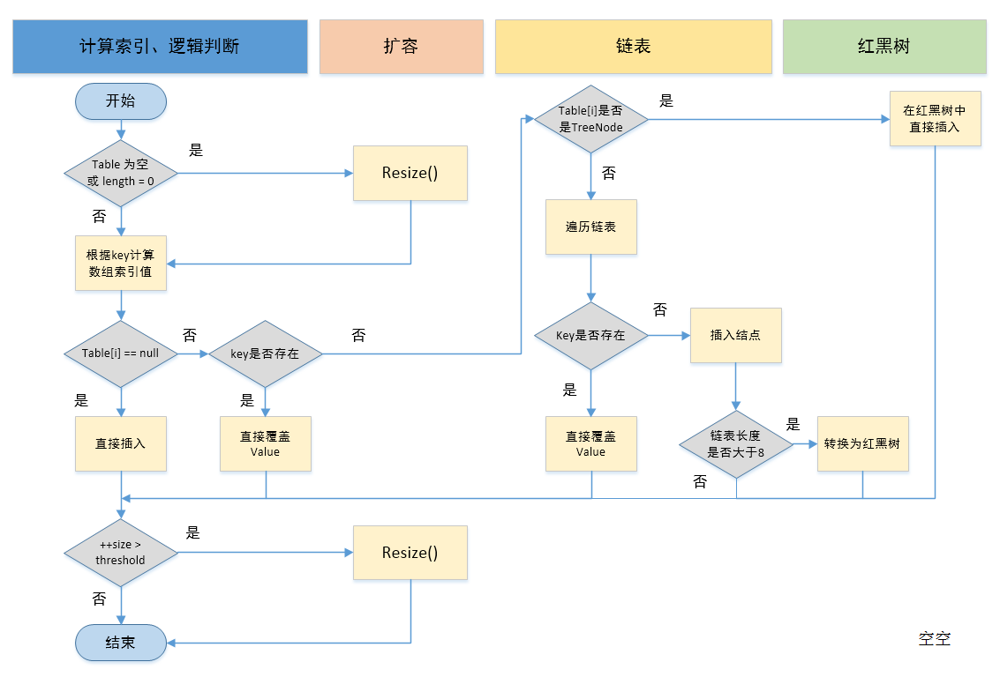
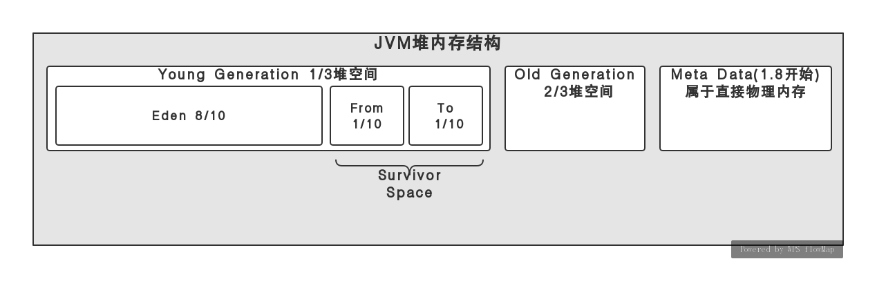
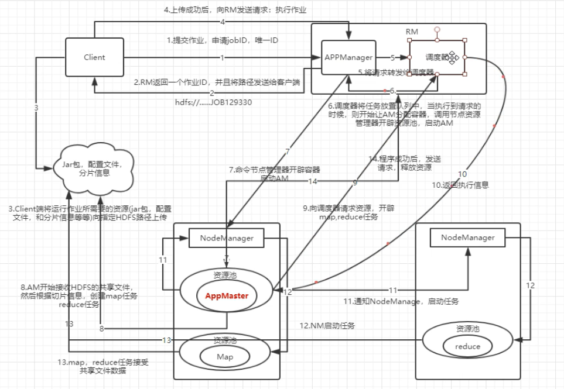

# Java知识总结

## Java基础

### 1、jdk和jre的区别 ###
> **Jdk：java development kit，java开发工具包，包含了创建java和编译java文件的工具、运行java程序的环境**
> **Jre：java Runtime environment，java运行时环境。**
> 运行java程序的话可以只要jre，开发编译java程序则需要jdk

**jdk的范围>jre范围**
### 2、== 和equals的区别 ###

- ==是用于比较两个对象的内存地址
- equals分两种情况
	- 如果类中重写的equals方法的话，那么就是根据具体的逻辑来比较两个对象，比如根据name值判断person是否相等
	- 如果没有重写equals方法，那么此时equals与==相同，都是比较对象的内存地址，因为Object中的equals方法就是使用==来进行比较两个对象 

### 3、 hashCode 和 equals ###
> 为什么重写equals时必须重写hashCode方法？

hashCode方法是获取对象在散列表中的哈希值。   
**需要重写hashCode的场景：**将对象放入HashMap中的，此时需要比较两个对象是否相等。  
equals和hashCode中有个约定：
	

	Whenever it is invoked on the same object more than once during an execution of a Java application, 
	the hashCode method must consistently return the same integer`  

- 当equals未被修改时，hashCode()应该返回同样的值。 
- 如果两个对象根据equals(Object)方法是相等的，那么调用这两个对象中任一个对象的hashCode方法必须产生同样的整数结果  

在日常开发中，Object的equals的方法一般是不满足需求的，如果重写了equals方法但是没有重写hashCode方法，则违反了上述第二条规则，所以重写了equals必须重写hashCode方法

### 4、序列化时忽略部分字段 ###
使用**transient**关键字来修饰变量

### 5、NIO与IO的区别 ###
NIO是一种同步非阻塞的I/O模型，在Java 1.4 中引入了NIO框架，对应 java.nio 包，提供了 Channel , Selector，Buffer等抽象

### 6、反射

> 使用场景：有一个List<T>数据，现传入参数Map<K, V>,key为T中的字段，需要根据传入的map对list进行过滤，此时可以使用反射获取Class对象，再通过从Class对象中获取getter方法来获取对象的值，从而完成了过滤

### 7、值传递与引用传递

> https://blog.csdn.net/zhzhao999/article/details/53449504#commentBox

-  基本数据类型在参数传递的时候是将值拷贝一份传给形参，无论对形参进行怎样的更改，都不会改变原来的值
-  String、数组或复杂对象在参数传递的时候会进行引用的拷贝，将拷贝后的引用传递给形参，但是String有些不同，**String**被创建之后就不能被更改，所以可以理解为**值传递**
-  值传递的时候，将实参的**值**，copy一份给形参
- 引用传递的时候，将实参的**地址值**，copy一份给形参

### 8、对象的创建

- 使用new关键字进行创建
- 通过反射获取class对象，使用newInstance方法创建对象
- 使用反序列化从文件中读取数据创建对象
- 使用clone()方法创建对象

### 9、对象的克隆

- 浅克隆：仅将对象的基本类型的属性进行克隆，对于复杂对象则采用**引用克隆**的方法，即对基本类型属性的修改不会对之前的产生影响；而对复杂对象的修改则会同步修改之前的对象
- 深克隆：基本属性和复杂对象都会进行克隆，即对基本类型属性、复杂对象的修改都不会影响之前的对象

> clone()方法属于Object基类，被protectd修饰

**使用方法：**

1. 实现**Cloneable**接口，若直接调用会出现**CloneNotSupportedException**异常
2. 若只需要对象的浅克隆，则不用重写clone方法
3. 若需要将对象进行深克隆，则**附属对象也需要实现Cloneable接口，并重写父级对象的clone方法**

### 10、HashMap




## 并发、线程 ##

熟悉线程的创建方式，线程池的原理及创建方式，有返回结果的线程

### 1. 线程的创建

#### 	1. 继承Thread类，重写run方法

#### 	2. 实现Runnable接口，实现run方法

#### 	3. 实现Callable<R>接口，实现call方法

### 2. 熟练使用线程池

> 使用Executors.newFixedThreadPool(5)类似方法进行获取线程池
>
> 通过new ThreadPoolExecutor(......)构造器自己创建线程池


## JVM

### 1. JVM内存模型(jdk1.8后) ###

- **线程独享**
	- 栈 
		> 由栈帧组成，栈帧由局部变量表、操作数栈、动态链接、方法出口信息构成。  
		> 局部变量表保存八大基本类型(boolean、byte、char、short、int、float、long、double)和对象引用 
	- 程序计数器
		
		> 生命周期与程序一致，记录当前线程执行程序的行号
	- 本地方法栈
		
		> 本地方法执行的时候，会在本地方法栈中创建一个栈帧，栈帧由局部变量表、操作数栈、动态链接、方法出口信息构成。 
- **线程共享**
	- 堆		
		> 保存实例对象

	- meta-space
		> **使用的是直接内存**  
		> 存放类的常量字段、静态变量和方法字节码以及一些特殊的方法和构造函数，接口代码也在此定义。简单来说，所有方法信息都存在方法区  
		**静态变量+常量+类信息(构造方法、接口定义)+运行时常量池**
### 2. HotSpot虚拟机 ###
#### 	1.对象的创建

  

1. ##### 类加载检查

   
	虚拟机遇到一条new指令时，首先将去检查这个指令的参数是否能在常量池中定位到这个类的符号引用，
	
	
	并且检查这个符号引用代表的类是否已被加载过、解析和初始化过。如果没有，那必须先执行相应的类加载过程
	
2. ##### 分配内存
	
	在类加载检查通过后，接下来虚拟机将为新生对象分配内存。
	
	
	对象所需的内存大小在类加载完成后便可确定，为对象分配空间的任务等同于把一块确定大小的内存从 Java 堆中划分出来。分配方式有 “指针碰撞” 和 “空闲列表” 两种，选择那种分配方式由 Java 堆是否规整决定，而 Java 堆是否规整又由所采用的垃圾收集器是否带有压缩整理功能决定。
	
### 3. JVM垃圾回收 ###


**使用idea查看程序heap使用情况：** VM options设置为：-XX:+PrintGCDetails 

#### java垃圾回收器的假设 ####
1. 大多数对象都会很快变得不可达
2. 只有很少的由老对象（创建时间较长的对象）指向新生对象的引用


#### GC流程 ####
1. 对象首先在eden区产生
2. 程序运行的过程中产生的对象越来越多，eden被装满后，会触发一次Minior GC，将eden中还存活的对象转移至To，并将对象的年龄设置为1
3. 当执行GC时，将Eden中的转移至To区，将From中仍存活的对象也复制到To，并将对象的年龄加1,同时交换From与To
4. 当对象的年龄增长至15时，则会将该对象转移至老年代,对象晋升到老年代的年龄阈值，可以通过参数 -XX:MaxTenuringThreshold 来设置
5. 当老年代满的时候则触发Full GC

#### 如何判断对象是否存活 ####
1. 引用计数法(无法避免循环引用的问题)
2. 可达性分析算法
	> 可达性分析法中，判定一个对象objA是否可回收，至少要经历两次标记过程：
	1、如果对象objA到 GC Roots没有引用链，则进行第一次标记。
	
	> 2、如果对象objA重写了finalize()方法，且还未执行过，那么objA会被插入到F-Queue队列中，由一个虚拟机自动创建的、低优先级的Finalizer线程触发其finalize()方法。finalize()方法是对象逃脱死亡的最后机会，GC会对队列中的对象进行第二次标记，如果objA在finalize()方法中与引用链上的任何一个对象建立联系，那么在第二次标记时，objA会被移出“即将回收”集合。


***引用***

1. **强引用**

	垃圾回收器不会回收强引用对象 
  
2. **软引用**

	    //100M的缓存数据
	    byte[] cacheData = new byte[100 * 1024 * 1024];
	    //将缓存数据用软引用持有
	    SoftReference<byte[]> cacheRef = new SoftReference<>(cacheData);
如果内存空间足够，垃圾回收器就不会回收它，如果内存空间不足了，就会回收这些对象的内存


3. **弱引用**

	    //100M的缓存数据
	    byte[] cacheData = new byte[100 * 1024 * 1024];
	    //将缓存数据用软引用持有
	    WeakReference<byte[]> cacheRef = new WeakReference<>(cacheData);
当垃圾回收器发现了弱引用的对象，不管内存空间是否足够都会回收这些对象的内存

4. **虚引用**

如果一个对象仅持有虚引用，那么它就和没有任何引用一样，在任何时候都可能被垃圾回收。虚引用主要用来跟踪对象被垃圾回收的活动。

### 4. 垃圾回收算法 ###

#### 1. 标记清除算法 ####
	将需要清除的对象进行标记，标记完成后同一回收被标记的对象
**存在的问题：**

- 会产生空间碎片
- 效率较低

#### 2. 复制算法 ####
	将内存分为相同的两块，对象只放在一侧的内存中，当清除掉被标记的对象时，将剩余的对象复制到另外一侧的内存中。
	每次垃圾回收都是针对一半的内存空间进行回收，同时不会产生内存碎片
#### 3. 标记整理算法 ####
	根据老年代的特点特出的一种标记算法，标记过程仍然与"标记-清除"算法一样，但后续步骤不是直接对可回收对象回收，
	而是让所有存活的对象向一端移动，然后直接清理掉端边界以外的内存
#### 4. 分代收集算法 ####
	将内存分为不同区域，每个区域采用不同的垃圾回收算法
	比如青年代，因为产生的对象很多，即将回收的对象也很多，回收率比较高，所以可以采用复制算法，减少内存碎片，提高回收效率
	如果是老年代，则可以使用标记-整理或者是标记-清除算法

----------

### 5. 垃圾收集器 ###
#### G1收集器 ####
G1收集器是一个面向服务器配置的垃圾收集器

**优点：**

1. 能充分利用服务器的多核cpu，减少gc阻塞时间
2. 分代收集，保留了青年代和老年代
3. 采用了标记-整理回收算法，不会产生内存碎片，有利于大对象的分配

### 6. tomcat调优

1. 出现如下错误：

   ```
   #
   # There is insufficient memory for the Java Runtime Environment to continue.
   # Native memory allocation (malloc) failed to allocate 1050800 bytes for Chunk::new
   # Possible reasons:
   #   The system is out of physical RAM or swap space
   #   In 32 bit mode, the process size limit was hit
   # Possible solutions:
   #   Reduce memory load on the system
   #   Increase physical memory or swap space
   #   Check if swap backing store is full
   #   Use 64 bit Java on a 64 bit OS
   #   Decrease Java heap size (-Xmx/-Xms)
   #   Decrease number of Java threads
   #   Decrease Java thread stack sizes (-Xss)
   #   Set larger code cache with -XX:ReservedCodeCacheSize=
   # This output file may be truncated or incomplete.
   #
   #  Out of Memory Error (allocation.cpp:390), pid=10720, tid=0x0000000000000a50
   #
   # JRE version: Java(TM) SE Runtime Environment (8.0_172-b11) (build 1.8.0_172-b11)
   # Java VM: Java HotSpot(TM) 64-Bit Server VM (25.172-b11 mixed mode windows-amd64 compressed oops)
   # Core dump written. Default location: D:\aitt\apache-tomcat-9.0.5\bin\hs_err_pid10720.mdmp
   #
   ```

   修改catalina.bat文件

   ```
   在echo Using CATALINA_BASE:   "%CATALINA_BASE%"的上面一行加下面代码：
   
   set JAVA_OPTS=-Xms1024m -Xmx4096m -XX:PermSize=128m -XX:MaxPermSize=256m
   
   加入后位置如下：
   
   rem ----- Execute The Requested Command ---------------------------------------
   
   set JAVA_OPTS=-Xms1024m -Xmx4096m -XX:PermSize=128m -XX:MaxPermSize=256m
   
   echo Using CATALINA_BASE:   "%CATALINA_BASE%"
   参数说明：
   -Xms1024m-Xms：初始Heap大小，使用的最小内存,cpu性能高时此值应设的大一些
   
   -Xms1024m-Xmx：java heap最大值，使用的最大内存
   
   上面两个值是分配JVM的最小和最大内存，取决于硬件物理内存的大小，建议均设为物理内存的一半。
   
   -XX:PermSize:设定内存的永久保存区域
   
   -XX:MaxPermSize:设定最大内存的永久保存区域
   ```

   

## spring

1. **什么是IOC、DI**
    IOC全称为：inversion of control，即控制反转，控制反转是对于程序中对象的创建来说的，传统对象的创建方法是直接在代码中进行new，由代码来控制创建对象的逻辑；而使用spring框架，则是让程序在运行的时候根据不同的情况来创建对象，由spring来管理对象的声明周期。

  DI全称为：Injection inversion，依赖注入，di是ioc的实现过程，di可以根据对象的字段、getset、构造器来进行对象的创建。

## Springcloud

### 1. Eureka ###
**Eureka Client**：负责将这个服务的信息注册到Eureka Server中

**Eureka Server**：注册中心，里面有一个注册表，保存了各个服务所在的机器和端口号
### 2. Ribbon ###
**负载均衡**：会帮你在每次请求时选择一台机器，均匀的把请求分发到各个机器上


**note：**
**出现超时重试**的时候要保证接口的幂等性:保证一个接口被多次调用的时候，不能插入重复的数据。
### 3. Feign ###
服务远程调用
### 4. Hystrix ###
隔离、熔断以及降级的一个框架

### 5. Zuul ###
前端、移动端调用后端系统，统一从Zuul网关进入，由Zuul网关转发请求给对应的服务


# 常用组件

### Redis ###

#### 1. redis的数据类型

**String、Set、Hash、List、SortedSet**

#### 2. redis缓存雪崩 ####

> redis缓存集体失效，请求全部前往数据库，很可能导致数据库down掉  

**解决办法** 

- redis实现高可用(主从架构+Sentinel 或者Redis Cluster)
- redis中的缓存失效时间上加一个随机值，避免大规模缓存同时失效
- 使用hystrix，通过熔断、降级、限流三个手段来降低雪崩发生后的损失

----------


#### 3. redis缓存穿透 ####
> 请求查询一个在redis中肯定不存在的数据

**解决办法**

- **推荐使用：**让恶意请求不到达数据库：将合法请求的key加入一个bitmap，每次判断请求中的key是否在bitmap中，如果不在的话就直接返回null
- 先导redis中查询是否存在数据，如果不存在的话去数据库查，如果查询结果为null的话，将空值也缓存到redis，下次查询直接返回缓存中的值(**缺点：**若每次非法请求的key都不同，仍会导致数据库的压力过大) 

----------
#### 4. 缓存击穿 ####
> 对于某个key，在过期的时候瞬间大量请求进行访问

**解决办法**
- 使用setnx设置一个互斥锁，返回成功后再去数据库查数据，将数据写入redis
- 缓存永不过期，但是后台逻辑判断是否过期，比如在缓存数据中加个过期时间字段

----------
#### 5. redis实现分布式锁 ####
1. **加锁：**key为加锁的对象，value为过期时间戳  
使用setnx，如果key不存在，则返回true，如果true存在，则判断锁是否过期（将redis中的值A与当前时间戳对比），如果未过期则返回false，如果过期的话，则使用getAndSet设置新的值，同时判断getAndSet的返回值与原redis中的值A是否相等，相等则返回true

#### 6. Redis优点

> 因为Redis的操作是基于内存，所以存取速度很快；Redis支持丰富的数据结构

#### 7.为什么redis单线程的效率这么高？

> 操作的内存，本身速度快
>
> 使用单线程，避免了上下文切换

#### 8. Redis的持久化策略

> 1. **RDB持久化**是指在指定的时间间隔内将内存中的数据集快照写入磁盘，实际操作过程是fork一个子进程，先将数据集写入临时文件，写入成功后，再替换之前的文件，用二进制压缩存储。
> 2. **AOF持久化**以日志的形式记录服务器所处理的每一个写、删除操作，查询操作不会记录，以文本的方式记录，可以打开文件看到详细的操作记录。

# 常见算法

### bitmap  
> 使用bit位来表示数据存在与否，比如性别为男可以创建为一个bitmap，若user为男，则将对应userId的bit为置为1，否则为0；多个bitmap可以进行并、交、异或操作
#### 实现步骤 ####
1. 存入：将待存入的数据分别与多个hash函数进行hash取值操作，然后将bitmap对应hash位置的值设置为1
2. 获取：用存入时的hash函数hash取值，然后从bitmap中取，如果结果全为true，则该值在bitmap中存在


# 设计模式

## 1. 策略模式

> 替代大量的if判断，满足对修改关闭，对扩展开放的原则

### 1. 实现过程

#### 1. 创建一个Interface，并编写抽象方法

```java
public interface Query {
	/**
	 * 调用入口
	 * @param datas idescartes数据
	 * @param params 查询参数
	 * @return httpResponse
	 */
	String query(List<Idescartes> datas, Map<String, Object> params);
}	
```

#### 2. 创建一个上下文对象，并持有该Interface，并提供一个方法供客户端调用，但方法内部仍是由调用Interface的方法

```java
public class QueryContext {
	private Query query;

	public QueryContext(Query query) {
		this.query = query;
	}

	public String query(List<Idescartes> data, Map<String, Object> params){
		if (query == null) {
			return HttpResponse.error("can't find the corresponding query type, see the detail : com.bitservice.dao.QueryFactory");
		}
		return query.query(data, params);
	}
}
```

#### 3. 需要不同处理逻辑的时候实现该Interface即可

#### 4. 提供一个工厂类，针对客户端不同的情况创建不同的对象

# 大数据

## 1. Hadoop

> **Hadoop Mr-v1**
>
> ​	运行时环境为：**JobTracker**和**TaskTracker**，JobTracker既负责任务调度也负责资源管理，很容易成为瓶颈，扩展性低；
>
> ​	Master为单节点，可用性不强；
>
> ​	资源利用率低：采用slot来划分资源，slot分为map slot和reduce slot，在任务开始阶段，reduce slot会出现闲置的情况
>
> ----------------------------------------------------------------------------------------------------------------------------------------------------
>
> **Hadoop Mr-v2**
>
> ​	将运行时环境改为了yarn，yarn中包含了Resource Scheduler和Application Manager，将资源调度和任务分配进行了隔离

### 1. HDFS

#### 1. NameNode

> 管理hdfs文件的元数据(目录结构)
>
> namenode会将对文件系统的修改记录作为日志追加到本地的文件系统中，当NameNode启动时，它从fsimage文件中读取HDFS状态，从编辑日志文件中应用编辑。然后它将新的HDFS状态写入fsimage并使用空的编辑文件开始正常操作。由于NameNode仅在启动期间合并fsimage和编辑文件，因此编辑日志文件在繁忙的群集上可能会随着时间的推移而变得非常大。较大的编辑文件的另一个副作用是下次重新启动NameNode需要更长的时间。

**Hadoop NameNode 如何承载每秒上千次的高并发访问?**

- 分段锁+内存双缓冲机制

1. 串行获取全局递增的transactionId(通过加锁实现全局递增)，获取到之后将edit-log写入内存区域A，然后释放锁，因为写入内存的速度会很快，所以即使是串行也不会耗费大量时间

2. 尝试第二次获取锁，如果发现有线程在进行磁盘或者网络的写操作，则sleep，并释放锁

3. 如果没有线程进行磁盘或者网络的写操作，则先判断是否存在有transactionId比自己大的线程已经将edit-log写入磁盘与JournalNodes集群，如果有的话，说明属于该线程的edit-log也被写入到磁盘和JournalNodes集群了，则释放锁

4. 如果不存在transactionId比自己大的线程已经将edit-log写入磁盘与JournalNodes集群，则将内存区域A与B进行交换，并释放锁，将内存区域A的数据写入到磁盘和JournalNodes集群，因为在写入数据到磁盘或者集群的过程中是不持有锁的，所以内存区域B仍可以正常写，写完之后唤醒之前休眠的线程

   

>  https://mp.weixin.qq.com/s?__biz=MzIxODM4MjA5MA==&mid=2247488139&idx=1&sn=8927925c0a7a886a28c0d53b435d47ff&chksm=97ea38eea09db1f8b51be5099364acb9a49f8b94b5ed9e1670cc12542bc7b95a051d55e051d9&scene=7&key=0e97a3aed232b8eb6b2f8983a8573bea00c37682bdf7834ab21ff8c4fff455db643061ffaf18e4c53af0f9023acc99b279e8940038c23c29b4cbf93ef98c1998707f552647803572a7b96fa6b576dc63&ascene=0&uin=MTI0Njc4ODU4NA%3D%3D&devicetype=Windows+10&version=62070152&lang=zh_CN&pass_ticket=aGa70xt%2FWGtxWSX0s7IfBKOBmdrzdaLb8SHbbE5x9TXsrZYHkkaL9LCR8YEx8xlw 

#### 2. DataNode

> 保存数据文件

#### 3. Secondary NameNode

> 对namenode的数据进行备份
>
> Secondary NameNode定期合并fsimage和编辑日志文件，在namenode挂掉之后合并fsimage和编辑日志文件，发送给namenode，防止数据丢失

#### 4. Hdfs的写数据流程

##### 		1. client向namenode发送写请求

##### 		2. namenode检查是否已存在该文件，目标路径的父路径是否存在，返回检查结果给client

##### 		3. 若接收到允许写的响应，则请求获取保存数据的datanode的信息

##### 		4. namenode对datanode进行检查，将分配信息发送回client

##### 		5. client先在本地根据blocksize进行文件的划分，根据返回的datanode信息请求多个datanode建立piplines

##### 		6. 多个datanode响应client，建立传输piplines，在client发送数据到其中一个datanode的同时(发送数据的大小为packet大小：默认为64kb)，数据会在pipline中流动，保存其他datanode

##### 		7. 写完一个block之后datanode会返回确认信息给client

##### 		8. 所有block写完之后datanode向namenode返回完成信号

#### 5. Hdfs的读流程

##### 		1. client向namenode发送读请求

##### 		2. namenode返回数据对应的datanode信息

##### 		3. client与datanode建立传输pipline获取数据

#### **6. Hadoop优化**

##### 	1. Hdfs小文件

###### 		影响

​	1. 影响NameNode的寿命，因为文件元数据存储在NameNode的内存中

​	2. 影响计算引擎的任务数量，比如每个小的文件都会生成一个Map任务

###### 		解决办法

1. 合并小文件：对小文件进行归档（Har）、自定义Inputformat将小文件存储成SequenceFile文件

​    `hadoop archive -archiveName pic.har -p /flink/data/ /flink/zip/ `

```查看HAR文件存档中的文件：
查看HAR文件存档中的文件：
hdfs dfs -ls har:///flink/zip/pic.har
```

​	2.采用ConbinFileInputFormat来作为输入，解决输入端大量小文件场景

​	3. 对于大量小文件Job，可以开启JVM重用

## 2. Yarn


### 1. 概念

>Yarn是一种新的Hadoop资源管理器，它是一个通用资源管理系统，可为上层应用提供统一的资源管理和调度，它的引入为集群在利用率、资源统一管理和数据共享等方面带来了巨大好处。

#### 1. ResourceManager

```
包含Application Manager和Resource Scheduler
ResourceManager是master上的进程，负责整个分布式系统的资源管理和调度。
处理来自client端的请求（包括提交作业/杀死作业）
启动/监控Application Master
监控NodeManager的情况
```

##### 1. Application Master

```
每一个提交到集群的作业都会有一个与之对应的Application Master来负责应用程序的管理
负责进行数据切分；为当前应用程序向ResourceManager去申请资源（也就是Container），并分配给具体的任务；
与NodeManager通信，用来启停具体的任务，任务运行在Container中；
任务的监控和容错也是由Application Master来负责的
```

##### 2. Resource Scheduler

```
资源调度器
```

#### 2. NodeManager

```中文
NodeManager时处在slave节点上的进程，负责当前slave节点的资源管理和调度，以及task的运行。
会定期向ResourceManager汇报资源/Container的情况（heartbeat）
接受来自ResourceManager对于Container的启停命令
```

#### 3. Container

```中文
包含了Application Master向ResourceManager申请的计算资源，比如说CPU/内存的大小
任务运行所需的环境变量和队任务运行情况的描述
Application Master和Map、Reduce都包含在Container里面
```

### 2. Yarn的资源调度器

#### 1. FIFO Scheduler


> 该调度器是一个先进先出队列，同时存在一个任务运行，先进入队列的任务先获得资源，优点是资源能充分利用，缺点是只能同时运行一个任务

#### 2. 容量调度器(Capacity Scheduler)


> Capacity调度器具有以下的几个特性：
> 1. 层次化的队列设计，这种层次化的队列设计保证了子队列可以使用父队列设置的全部资源。这样通过层次化的管理，更容易合理分配和限制资源的使用。
> 2. 容量保证，队列上都会设置一个资源的占比，这样可以保证每个队列都不会占用整个集群的资源。
> 3. 安全，每个队列又严格的访问控制。用户只能向自己的队列里面提交任务，而且不能修改或者访问其他队列的任务。
> 4. 弹性分配，空闲的资源可以被分配给任何队列。当多个队列出现争用的时候，则会按照比例进行平衡。
> 5. 多租户租用，通过队列的容量限制，多个用户就可以共享同一个集群，同事保证每个队列分配到自己的容量，提高利用率。
> 6. 操作性，Yarn支持动态修改调整容量、权限等的分配，可以在运行时直接修改。还提供给管理员界面，来显示当前的队列状况。管理员可以在运行时，添加一个队列；但是不能删除一个队列。管理员还可以在运行时暂停某个队列，这样可以保证当前的队列在执行过程中，集群不会接收其他的任务。如果一个队列被设置成了stopped，那么就不能向他或者子队列上提交任务了。
> 7. 基于资源的调度，协调不同资源需求的应用程序，比如内存、CPU、磁盘等等。

#### 3. 公平调度器(Fair Scheduler)


> Fair调度器是一个队列资源分配方式，在整个时间线上，所有的Job平均的获取资源。
>
> 默认情况下，Fair调度器只是对内存资源做公平的调度和分配。当集群中只有一个任务在运行时，那么此任务会占用整个集群的资源。当其他的任务提交后，那些释放的资源将会被分配给新的Job，所以每个任务最终都能获取几乎一样多的资源。

### 3. yarn任务提交流程



### 4. spark使用yarn作为资源调度管理系统时的资源分配

> <https://blog.csdn.net/rlnLo2pNEfx9c/article/details/81844218>


## 2. Spark

### 1. 常见算子

#### 1. groupByKey

> 没有在map端进行combine，所以执行的代价可能会比较大，推荐使用reduceByKey

#### 2. XXXPartitions

> 作用对象为partition，而不是单个的元素，在操作数据库时一定要使用类似算子，一个partition一个connection

### 2. RDD、DataFrame、DataSet的区别

> https://blog.csdn.net/fct2001140269/article/details/82560862

RDD是分布式的java对象集合，spark并不知道每个RDD中的对象的具体的字段信息

DataFrame是分布式的row对象集合，可以很明确的知道每列数据的名称和字段类型，通过row.getAs[ T ]("名称")来获取值

DataSet是特殊的DataFrame，每行数据是强类型的对象，可以直接通过对象.属性获取数据


### 3. SparkStreaming消费Kafka中的数据

#### 1. Receiver

#### 2. Direct

### 4. 架构流程分析

- spark中有Master和Worker节点，Master节点负责任务的调度分配，Worker负责任务的计算
- Driver是程序的入口，也是我们写的main函数，在Driver中会对SparkContext或者SparkSession进行实例化
- Job可以简单理解为一个class中根据action算子进行划分的code
- Executor是Worker中的计算spark任务的进程，一个Executor中会有多个任务
- Stage是根据shuffle进行划分的
- task则是组成stage的单元，一个partition一个task

##### 远程监控spark进程

###### 1. 在spark-defaults.conf中配置：

```
spark.driver.extraJavaOptions   -Dcom.sun.management.jmxremote.port=1099
-Dcom.sun.management.jmxremote.ssl=false -Dcom.sun.management.jmxremote.authenticate=false
```

###### 2. 修改远程配置

```
cd /usr/local/jdk1.8.0_171/jre/lib/management
sudo cp jmxremote.password.template jmxremote.password
sudo chmod +w jmxremote.password
```

###### 3. 在jdk目录下打开**jvisualvm.exe**，建立远程jmx连接


### 5. 常见问题

#### 1. spark写入hdfs出现大量小文件

> <https://blog.csdn.net/jiangmeng0606/article/details/86655323

### Spark大数据分析书籍随笔

#### 第六章 RDD的高级操作

##### 1. RDD缓存机制

- 调用RDD.cache或者是RDD.persist方法进行RDD的缓存
- 使用场景：存在一个RDD的生成需要花费大量时间，且后续会多次有基于该RDD的计算，这时可以将该RDD进行缓存
- 缓存RDD是将该RDD内的数据存入内存、磁盘或者其他外部基于内存的介质中
- 缓存不会切换RDD依赖链，当缓存失效时，可以通过RDD的依赖链计算出RDD中的数据

##### 2. CheckPoint机制

- 将RDD的数据存储到本地磁盘或者是hdfs（**生产环境使用**）上
- 使用场景：RDD依赖链较长，并且其中一个RDD是后续多个RDD的上级依赖，此时可考虑将该RDD进行checkpoint
- checkpoint会**切断RDD的依赖链**，如果出现任务失败的情况，可直接读取hdfs上的数据来对RDD进行恢复
- 当出现有action算子的时候，checkpoint才会生效

- 当打算对某个RDD进行checkpoint时，需要**先对该RDD进行缓存**，因为在checkpoint的时候是先runjob，再checkpoint

```scala
def runJob[T, U: ClassTag](
      rdd: RDD[T],
      func: (TaskContext, Iterator[T]) => U,
      partitions: Seq[Int],
      resultHandler: (Int, U) => Unit): Unit = {
    if (stopped.get()) {
      throw new IllegalStateException("SparkContext has been shutdown")
    }
    val callSite = getCallSite
    val cleanedFunc = clean(func)
    logInfo("Starting job: " + callSite.shortForm)
    if (conf.getBoolean("spark.logLineage", false)) {
      logInfo("RDD's recursive dependencies:\n" + rdd.toDebugString)
    }
    dagScheduler.runJob(rdd, cleanedFunc, partitions, callSite, resultHandler, localProperties.get)
    progressBar.foreach(_.finishAll())
    rdd.doCheckpoint()
  }
```

- 使用方法：
  - sparkContext.setCheckpointDir("hdfs://xxx")
  - rdd.cache
  - rdd.checkpoint

- checkpoint流程源码分析

  - sparkContext设置checkpoint目录

    ```
    /**
       * 设置checkpoint目录
       * @param directory 存储checkpoint文件的目录
       * (如果在集群运行的话必须设置为hdfs上的地址)
       * 先连接hdfs，通过给定的路径创建目录，并返回该目录
       */
      def setCheckpointDir(directory: String) {
    
        // If we are running on a cluster, log a warning if the directory is local.
        // Otherwise, the driver may attempt to reconstruct the checkpointed RDD from
        // its own local file system, which is incorrect because the checkpoint files
        // are actually on the executor machines.
        if (!isLocal && Utils.nonLocalPaths(directory).isEmpty) {
          logWarning("Spark is not running in local mode, therefore the checkpoint directory " +
            s"must not be on the local filesystem. Directory '$directory' " +
            "appears to be on the local filesystem.")
        }
    
        checkpointDir = Option(directory).map { dir =>
          val path = new Path(dir, UUID.randomUUID().toString)
          val fs = path.getFileSystem(hadoopConfiguration)
          fs.mkdirs(path)
          fs.getFileStatus(path).getPath.toString
        }
      }
    ```

  - rdd.checkpoint

    > 调用该方法的时候会首先创建出**RDDCheckpointData**，并将RDD的状态标志为：**Initialized**，在这里并不会真正将RDD中的数据checkpoint到Hdfs上，只是作一个标记

    ```scala
    /**
       * 将这个rdd标记为待checkpoint，该rdd会保存到上一步设置的目录中
       * 最好在第一个action算子之前调用该方法，在调用该方法之前推荐将RDD缓存在内存中，否则的话checkpoint方法会导致第二次计算
       */
      def checkpoint(): Unit = RDDCheckpointData.synchronized {
        // NOTE: we use a global lock here due to complexities downstream with ensuring
        // children RDD partitions point to the correct parent partitions. In the future
        // we should revisit this consideration.
        if (context.checkpointDir.isEmpty) {
          throw new SparkException("Checkpoint directory has not been set in the SparkContext")
        } else if (checkpointData.isEmpty) {
          checkpointData = Some(new ReliableRDDCheckpointData(this))
        }
      }
    ```

  - checkpoint的触发

    > 在调用RDD.checkpoint方法之后的第一个action算子，会间接调用到SparkContext的runjob方法

    ```scala
    def runJob[T, U: ClassTag](
          rdd: RDD[T],
          func: (TaskContext, Iterator[T]) => U,
          partitions: Seq[Int],
          resultHandler: (Int, U) => Unit): Unit = {
        if (stopped.get()) {
          throw new IllegalStateException("SparkContext has been shutdown")
        }
        val callSite = getCallSite
        val cleanedFunc = clean(func)
        logInfo("Starting job: " + callSite.shortForm)
        if (conf.getBoolean("spark.logLineage", false)) {
          logInfo("RDD's recursive dependencies:\n" + rdd.toDebugString)
        }
        dagScheduler.runJob(rdd, cleanedFunc, partitions, callSite, resultHandler, localProperties.get)
        progressBar.foreach(_.finishAll())
        //在最后对checkpoint进行调用
        rdd.doCheckpoint()
      }
    ```

    ```scala
    /**
       * 递归在父RDD上调用该方法
       * 
       */
      private[spark] def doCheckpoint(): Unit = {
        RDDOperationScope.withScope(sc, "checkpoint", allowNesting = false, ignoreParent = true) {
          if (!doCheckpointCalled) {
            doCheckpointCalled = true
            if (checkpointData.isDefined) {
              if (checkpointAllMarkedAncestors) {
                // TODO We can collect all the RDDs that needs to be checkpointed, and then checkpoint
                // them in parallel.
                // Checkpoint parents first because our lineage will be truncated after we
                // checkpoint ourselves
                dependencies.foreach(_.rdd.doCheckpoint())
              }
              //具体的逻辑
              checkpointData.get.checkpoint()
            } else {
              dependencies.foreach(_.rdd.doCheckpoint())
            }
          }
        }
      }
    ```

    > 如果RDD的状态已经标记为**Initialized**，则将状态更改为：**CheckpointingInProgress**，checkpoint成功后，将状态更改为**Checkpointed**，并将RDD的依赖切断，清除父级依赖

    ```scala
    final def checkpoint(): Unit = {
        // Guard against multiple threads checkpointing the same RDD by
        // atomically flipping the state of this RDDCheckpointData
        RDDCheckpointData.synchronized {
          if (cpState == Initialized) {
            cpState = CheckpointingInProgress
          } else {
            return
          }
        }
    	//具体的checkpoint实现
        val newRDD = doCheckpoint()
    
        // 更新RDD状态并切断lineage
        RDDCheckpointData.synchronized {
          cpRDD = Some(newRDD)
          cpState = Checkpointed
          rdd.markCheckpointed()
        }
      }
    ```

##### 3. RDD的依赖关系

- 窄依赖（Narrow Dependencies）

  > 父RDD的分区策略如果与子RDD的分区策略相同则为窄依赖
  >
  > 分区策略：Partitioner+分区数
  >
  > 当两个分区策略相同(HashPartitioner)的RDD先groupByKey(分区数A)，再join(分区数A)，之间的依赖依然是窄依赖(groupByKey的默认分区策略为HashPartitioner)

  ```scala
  val rddData3 = rddData1.groupByKey(2)
  val rddData4 = rddData2.groupByKey(2)
  val rddData5 = rddData3.join(rddData4, 2)
  ```

  - 一个父RDD与一个子RDD一一对应(map)

  - 多个父RDD与一个子RDD

    > 多个父RDD的所有分区对应一个子RDD

  - 多个父RDD的分区合并为子RDD的分区

    > 两个分区数相同的父RDD进行join，生成子RDD的过程为窄依赖

- 宽依赖

  > 父RDD中的某一个分区被多个子RDD的分区所依赖
  >
  > 当父RDD与子RDD的分区策略或者是分区数不相等时就会产生宽依赖
  >
  > shuffle transformation算子才会产生宽依赖

- 宽依赖产生stage，同一个stage内的partition都是相等的，而一个partition对应一个task，所以同一个stage内的task数量也是相等的

##### 4. 累加器

- sparkContext.longAccumulator(name: String)

  > 一般用来计数，在使用的时候注意不要出现accumulator重复计算的情况

  - 一般在使用accumulator.add(1L)之后就对该RDD进行cache，否则可能会出现对该RDD调用多次action算子导致accumulator重复计算的情况

- 暂称为集合累加器吧：sparkContext.collectionAccumulator\[T](name: String): CollectionAccumulator[T] 

- 自定义累加器：继承AccumulatorV2[IN, OUT]，重写方法

  > ## **note**:output类型应该定义为线程安全的类型 


##### 5. 广播

- 广播是将数据以**只读**的形式缓存到每台worker上，减少网络开销，同时也可以减少cpu的序列化与反序列化
  - 广播的数据量不宜过大，因为该数据会在每个executor中存放，所以如果数据量过大会引发内存消耗过度

#### 第七章 SparkSql

##### 1.  不同版本之间spark的差异

- 在spark1.x中，sparkContext是主要的切入点，分析业务基本上都是面向RDD的

- 随着后来Spark的升级，面对不同的业务产生了不同的Context实例对象，例如处理结构化数据的SQLContext、HiveContext

- DataFrame和DataSet逐渐成熟，可以使用SparkSession作为统一的入口

  ```
  val spark = SparkSession.builder()
        .master("local[*]")
        .appName(getClass.getSimpleName)
        .getOrCreate()
  val sc = spark.sparkContext
  val sqlContext = spark.sqlContext
  ```

  

##### 2. DataFrame、DataSet的基本操作

###### 1. 基本流程

- 输入数据

- 分析数据

  - 执行sql语句进行分析

    - 先将DataFrame或者DataSet注册为临时视图

      ```
      视图分为会话临时视图和全局临时视图
      会话临时视图：
      	df1.createTempView("t_user")
          df1.createOrReplaceTempView("t_user")
      全局临时视图：
      	df1.createGlobalTempView("t_user")
          df1.createOrReplaceGlobalTempView("t_user")
      移除临时视图：
      	spark.sqlContext.dropTempTable("t_user")
      清除临时视图在内存中的缓存：
          spark.sqlContext.uncacheTable("t_user")
      ```

    - 执行sql语句

  - 执行DSL(Domain Specific Language)

    ```scala
    df1.select($"name", $"age", $"sex").filter($"sex" === "Female" && $"age" < 25)
    ```

- 输出数据

###### 2. 读取代码中动态生成的数据

- 通过序列或者集合来创建DataFrame

  ```
  val df = spark.createDataFrame(List(("zhangsan", "male", "20")
        , ("lisi", "female", "18")
        , ("wangwu", "male", "24")))
  df.show(false)
  ```

- 自定义schema

  ```
  //自定义Schema
  val schema = StructType(List(
    StructField("name", StringType, nullable = true),
    StructField("gender", StringType, nullable = true),
    StructField("age", StringType, nullable = true)
  ))
  //这里需要java的List，并且泛型为Row
  val data = new util.ArrayList[Row]()
  data.add(Row("zhangsan", "male", "20"))
  data.add(Row("lisi", "female", "18"))
  data.add(Row("wangwu", "male", "24"))
  val df = spark.createDataFrame(data, schema)
  df.show(false)
  ```

###### 3. 将DataFrame的数据输出到关系型数据库

```scala
val properties = new Properties()
    properties.setProperty("user", "root")
    properties.setProperty("password", "123456")
val url = "jdbc:mysql://localhost:3306/test?useUnicode=true&characterEncoding=utf8&serverTimezone=Asia/Shanghai"

df.write.mode(SaveMode.Ignore).jdbc(url, "student", properties)
```

> mode有多种模式：
>
> overwrite：覆写模式，将已存在的数据直接覆盖
>
> append：追加
>
> ignore：若不存在，则建表并写入，否则不进行任何操作
>
> ErrorIfExists：如果表已存在，则直接抛出异常


## 3. Flink

## 4. Hive

## 5. Hbase

## 6. Kafka

### kafka相关的概念名词 ###
- **broker**
> broker是指kafka的实例，直观理解就是服务器上部署了kafka应用，那么这台服务器就是一个broker

- **producer**
> 消息的生产者，producer将消息分发到指定的topic中  

- **consumer**   
> 消息的消费者，consumer指定topic进行消费

- **consumer group**
> 消费者组，一个group中可以有多个消费者。一个分区的数据只能被消费者组中的某一个消费者消费；同一个消费者组的消费者可以消费同一个 Topic 的不同分区的数据

- **topic**  
> 消息所属的主题，获取消息就得首先确定topic，一个broker上可以有多个topic

- **partition**
> topic的物理分区，多个partition中会有一个leader，其余的都是follower

- **zookeeper**
> 保存kafka集群的元信息，以此保障系统的可用性


### kafak的作用 ###
1. 充当流式数据的数据源
2. 解耦、异步通信。不同的系统之间基于topic消息处理来交互，便于扩展
3. 削峰
4. 数据顺序的保证


### kafka的运行模式 ###
1. producer将消息push到broker上
2. broker将消息持久化到磁盘上(顺序读写，提高读写速度)
3. consumer从broker上pull消息

### ISR ###

> 全称是“In-Sync Replicas”，也就是保持同步的副本，它的含义就是，跟 Leader 始终保持同步的 Follower 有哪些


# 通用知识点

###### 1. 如何实现一次性语义？

- 系统的幂等性

  ```
  将用于区别重复数据的列值进行md5，然后存入db，后续处理的时候判断是否已经处理过该数据
  比如将名字、电话两个维度加在一起md5作为唯一键，后续用该键来判断是否会处理重复数据
  ```

- 采用事务的方式(不常用)


# question #
## 大数据 ##

- SparkStreaming消费kafka，刚开始就会创建很多分区、很大的并行度，十分浪费性能，怎么解决？
- Hbase的读写过程
- Hbase的rowkey设计要注意什么问题
- yarn的三种调度模式，分别什么特点
- spark数据倾斜问题解决

## scala ##

- scala隐式转换怎么实现

  - 让某个类获得另一个类的方法

  - 首先定义一个增强类，将待转换的类作为构造参数传入

  - 定义隐式转换，将待转换的类转换为增强类

    ```scala
    package chapter8
    
    class RichNumber(var number : Double){
      def print(): Unit ={
        println("number的值是："+number)
      }
    }
    
    object ImplicitAspect{
      implicit def number2RichNumber(number : Double) = new RichNumber(number)
    }
    
    object Test {
      def main(args: Array[String]): Unit = {
        import ImplicitAspect.number2RichNumber
        2.2.print()
      }
    }
    输出：
    number的值是：2.2
    ```

- case class和class的区别

## java基础 ##

- volatile讲解
  - volatile的作用是控制变量在线程间的可见性和有效性，当某个线程对该变量进行修改了之后，会将该变量刷新到主存中，其他变量读取的时候也是强制从主存中进行读取。
- HashMap为什么线程不安全
  - 
- ThreadLocal怎么用
- 类加载机制
- 内存模型(双亲委派模型)
- java哪个GC的次数比较多？详细讲解CMS、G1，为什么会有内存碎片？
- 双重校验锁
- Synchronized锁的是什么，用什么锁对象是内存占用最小的(new byte[0])
- 如何判断对象是否死亡（两种方法）
- 简单的介绍一下强引用、软引用、弱引用、虚引用（虚引用与软引用和弱引用的区别、使用软引用能带来的好处）
- 如何判断一个常量是废弃常量
- 如何判断一个类是无用的类
- 垃圾收集有哪些算法，各自的特点？
- HotSpot 为什么要分为新生代和老年代？
- 常见的垃圾回收器有那些？
- 介绍一下 CMS,G1 收集器。
- Minor Gc 和 Full GC 有什么不同呢

## Nosql ##
### redis ###

- redis缓存雪崩、缓存穿透、缓存击穿分别怎么解决
- redis的数据结构
- 怎么实现分布式锁

## 消息中间件 ##
### kafka ###


> https://mp.weixin.qq.com/s?__biz=MjM5ODI5Njc2MA==&mid=2655823925&idx=1&sn=a976017125ca2e8e5a8b8404cccd6f73&chksm=bd74e5e28a036cf4c4451c570167c747ed53c53685cf14de2b01abc11f63dae99059ace216c4&scene=7&key=fbb91313c19f948d14bbdf2f046d7833759e6110795540a75e30e0c32e72f6dd067155d1f01e1e4b6bef5c32dd911cfd824ab2132322c60e92c29bd6149a5f34ea98d8025848d47670264f710a4a9f62&ascene=0&uin=MTI0Njc4ODU4NA%3D%3D&devicetype=Windows+10&version=62060833&lang=zh_CN&pass_ticket=DqS8%2B2gk2Cm25gZ93m5UXU%2FDGQSVLQotOrOrbIiBU3tQlBLi%2FZoLbTae1cq07ni6

- 什么是Apache Kafka
- Kafka中有哪几个组件
- offset的作用
- Kafka的优点
- ZooKeeper在Kafka中的作用是什么
- 什么确保了Kafka中服务器的负载平衡
- 副本和ISR扮演什么角色
- 在生产者中，何时发生QueueFullException
- 解释Kafka可以接收的消息最大为多少
- ISR在Kafka环境中代表什么
- 比较RabbitMQ与Apache Kafka
- Apache Kafka的缺陷
- kafka acks参数的含义
- 为什么低版本的kafka将offset保存到zk，高版本保存到topic


## DB ##

- 数据库连接池参数设置
> 连接数 = ((核心数 * 2) + 有效磁盘数)  
> 
> 服务器 CPU 是 4核 i7 的，连接池大小应该为 ((4*2)+1)=9
> 
> 连接池中的连接数量大小应该设置成：数据库能够有效同时进行的查询任务数（通常情况下来说不会高于 2*CPU核心数）

### mysql ###

- mysql常见数据库引擎，各自的优势
- 索引失效问题
- MySQL实现可重复读的原理
- 事务隔离级别
- 主从同步的原理,如果往主库写了一份数据想要立马读取，该怎么实现？
> 有马上读取的需求的话可以直接读主库，或者往主库写了之后往内存中也写一份，从内存中读取

- B+ 树的原理，Innodb 引擎和 myisam 引擎的区别和使用场景

- 为什么用自增列作为主键
> https://mp.weixin.qq.com/s?__biz=MzU0OTk3ODQ3Ng==&mid=2247485460&idx=1&sn=3543e2316b811604333b2d4bbda57948&chksm=fba6e017ccd16901681a2bdd3021f7f40c54820187570d60aebe94f6211075ea6e4d99df0ba0&mpshare=1&scene=1&srcid=&key=db09d759dd437ecfbc43b595c33bbc116f931474aa8eff665a1549d97713d8e6c462506017870a6865908c56a1eefd9d660fd0fea575fe25ef679b6003bb5687a68f27d832051f60a109043283edf92a&ascene=1&uin=MTI0Njc4ODU4NA%3D%3D&devicetype=Windows+10&version=62060833&lang=zh_CN&pass_ticket=5t9esHdQv5%2F28HLA6iyMRPzS3FPBQyMaZta6um78z%2FKEqHT1tUz%2FuoxLaK3nZ7dy

- MySQL联合索引
- 什么情况下应不建或少建索引

> 1、表记录太少  
> 
> 2、经常插入、删除、修改的表
> 
> 3、数据重复且分布平均的表字段，假如一个表有10万行记录，有一个字段A只有T和F两种值，且每个值的分布概率大约为50%，那么对这种表A字段建索引一般不会提高数据库的查询速度。
> 
> 4、经常和主字段一块查询但主字段索引值比较多的表字段 
### oracle ###

## 框架 ##
### springcloud ###

- eureka执行流程，eureka和zookeeper的区别

这个是Java初中级工程师核心必考的题非常重要一定要过两遍（非常重要）最好是下载下来慢慢看
https://www.bilibili.com/video/av55997950
淘淘商城：一个分布式电商项目，里面涉及的知识点挺多的值的敲一遍
链接：https://pan.baidu.com/s/1OVgGtlij05lZ6OhxRkGCCg 
提取码：wu9s 
还有32个面试题是一个大框架，讲的非常笼统，可以说是提供一个学习方向吧
https://kaiwu.lagou.com/course/courseInfo.htm?courseId=1&sid=3-market_32-0
jdk1.8的新特性还是很有用的
https://www.bilibili.com/video/av33589600/
实用博客
https://blog.csdn.net/xchnba2107
http://blog.java1234.com/index.html

#### 1.gc算法有哪些，在什么地方使用?

> 标记清除算法：将待清除的对象进行标记，只清除被标记的对象，缺点是会产生内存碎片
>
> 复制清除算法：将内存分为两个空间，进行gc时，将未被清除的对象复制到另一内存区域，只清理剩余的对象，缺点是可能复制的对象很多
>
> 标记整理算法：将待清除的对象进行标记，存活的对象向一端移动，以分界点为边界进行内存的清除
>
> 分代收集算法：青年代使用复制清除算法，因为剩余的对象比较少；而老年代使用标记清除或者标记整理算法

#### 2.join shuffle是怎么实现的，如果自己写代码怎么写？

> <https://blog.csdn.net/wlk_328909605/article/details/82933552>

> 先进行keyBy，然后再进行map
>
> spark sql中的join（事实表join维度表）优化：
>
> 1. 将事实表进行broadCast，使得每个excutor在本地获取到broadCast value后即可以进行join（要求：事实表不能超过spark.sql.autoBroadcastJoinThreshold设置的值，默认是10M）
> 2. sort merge join：将两张表进行hash repartition并进行排序，然后再进行join，如果相同则输出，左边小则取左边，否则取右边
> 3. shuffle hash join：将两张表都进行hash repartition

#### 3.topN场景，如果iterator里的记录特别多，怎么选出前10个？时间复杂度是多少？怎么写代码可以降低复杂度？

- 场景：住房套次、房屋成交均价

4.hdfs上有一个大的xml文件，统计学生成绩？ 

<info>
    <student>s1</student>
    <class>c1</class>
    <grade>g1</grade>
</info>
<info>
    <student>s2</student>
    <class>c2</class>
    <grade>g2</grade>
</info>
...
...
5.看过哪些Spark源码，用了什么设计模式?
6.解释rdd五大特性
7.SVM的缺点是什么
8.怎么判断Flume收集的延迟数据，全部收集完成？
9.项目的数据量多大，集群规模多大？
10.为什么要修改taildir source源码，不修改有没有其他方案，flume版本？
11.kafka偏移量管理？
12.为什么跳槽？
13.Kafka的消息备份机制，isr，怎么保证高可靠？
14.HBase为什么不要超过三个列族(列簇)，谈谈行键设计
15.Shuffle过程中的组成部分
16.where, group by, having, order by , limit 在MySQL中的执行顺序
17.常用排序算法中复杂度为O（n2）的和O（nlogn）的分别有哪些，写出一个O（nlogn）的排序，（我写的快排）它的空间复杂度是多少 ? 18.写代码，判断一个单链表是不是个环。时间复杂度，空间复杂度。怎么优化降低时间复杂度
19.Spark什么情况下OOM，怎么解决
20.有一张学生表 

学号 | 选课程号
01  |   110
02  |   120
...
选出包含学号为‘01’的学生所选课程的所有学生的学号 

21.一个文件有一百万个数字，现在内存只能存下2万个，怎么对这一百万个数字排序？
22.画出你们公司项目的架构，瓶颈在哪里?
23.流处理计算出错了，需要重算，怎么处理？24.谈谈Spark RDD 的几大特性，并深入讲讲体现在哪
25.说说你参与过的项目，和一些业务场景
26.请说说Spark的宽窄依赖
27.Spark的stage划分，task跟分区的关系
28.详细讲讲Spark的内存管理，计算与存储是如何协调的
29.rdd df ds 之间的区别 ，什么时候使用ds
30.聊聊kafka消费如何保证不会重复消费
31.你项目里说到了数据延迟和数据重跑，请你说说当时是怎么解决的，如何保障幂等性！
32.数据质量管理怎么做的
33.zk的选举机制是怎样的
34.kafka出现消息堆积怎么办
35.kafka数据重复怎么办
36.说说数仓项目的整个架构
37.为什么选用Maxwell，而不是阿里的canal？
38.canal怎么配置的，HA是怎样的
39.Maxwell为什么要二次开发？
40.Phoenix使用中遇到过哪些问题 

41.Phoenix 多表join有用过吗，会怎样？
42.Spark的内存调优有涉及哪些参数
43.生产上的集群规模是多少
44.每天的数据量是多少
45.集群上有多少个作业在跑
46.数据倾斜怎么解决的
47.Spark SQL select count(1) from tmp 的执行计划是怎么走的
48.yarn的调度队列是怎样的
49.Spark job的提交流程
50.一个stage中有8个task，spark 中有两个executor，那么task是怎么分配的。（这个问题我一直没明白什么意思，后面沟通中才知道，面试官想问的是数据本地性）
51.java线程池有哪些
52.java线程有哪几种
53.数组与arrayList互转的方式
54.数组的排序怎么做的
55.java中主线程需要等待多个子线程执行完成后，才能继续执行怎么做？当超过指定时间后，也继续执行怎么做？
56.一个子线层中一直在while (true) 主线程如何控制子线程退出
57.手写了两道面试官临时想出来的算法题
58.spring mvc的接收到请求后执行流程
59.requestBody和responseBody这两个注解是做什么的
60.mybatis中ResultType和ResultMap的区别 

61.如何向数据库中批量插入数据
62.然后还有几个前端及前端与后端交互的问题,skip
63.10亿条数据，求top10如何优化、优化、优化（就是取前十条数据，不是组内求和）
64.HDFS的读写流程
65.HBase的读写流程
66.JVM如何调优
67.数据质量管理怎么做的?
68.Spark 广播变量在项目中如何运用的?
69.Spark 累加器在这个项目中用来做什么？
70.通过shell做监控会吗？
71.namenode和datanode挂掉了如何解决
72.Spark VS Flink VS Storm
73.Hive优化参数
74.MR的执行流程
75.说说这个实时数仓项目的执行流程
76.说说Flink的架构
77.HBase的二级索引如何构建?
78.HBase如何保证数据不丢失?
79.幂等性主要解决什么?
80.谈谈你是如何对Flume如优化的? 

81.你们公司APP的埋点日志是如何收集的？
82.你们公司的数仓有几层、是哪几层、维表在哪层?
83.每天的业务量是多少？高峰和低谷是多少？
84.集群规模是怎样的？资源是如何分配的？
85.如何解决shuffle，不要回答那种网上一搜的全是互相摘抄的，有没有自己的独特解决案例？
86.你们ETL处理流程是怎样的
87.数仓项目MySQL数据是如何采集的？
88.你的离职原因是什么？
89.小文件合并是怎么合并的
90.源数据质量管理是怎么管理的
91.重跑数据的时候数据幂等是怎么做的
92.压缩格式是用的什么，文件格式是什么
对方回答，哇，gzip这个高的压缩，你们数据量很大吗？
每天的增量数据有多少？
93.优化前后的对比，大概是这个优化前后性能提高了多少
94.topic是别人定好了，是自己在spark中按照约定好的topic进行消费吗？
95.kafka对接spark offset是维护在一个表中吗？
96.mysql的存储过程会写
97.为什么要在hbase中创建一个元数据表保存每个表的字段和主键,删除的时候要查一遍
而那upsert的时候也要有主键，为什么不用！
98.phoenix盐表解决数据热点的原理
99.hbase的rowkey是怎么设计的
100.实时数仓项目预估要落地有多少数据量？


## 

**大数据面试题**

<https://blog.csdn.net/fct2001140269/article/details/84576500

<https://blog.csdn.net/fct2001140269/article/details/81676107>

<https://blog.csdn.net/fct2001140269/article/details/82913984>


##### 下列哪项通常是集群的最主要瓶颈

> 磁盘 IO
> 首先集群的目的是为了节省成本，用廉价的 pc 机，取代小型机及大型机。小型机和大型机有什么特点？
>
> 1. cpu 处理能力强
>    2.内存够大，所以集群的瓶颈不可能是 a 和 d
>    3.如果是互联网有瓶颈，可以让集群搭建内网。每次写入数据都要通过网络（集群是内网），然后还要写入 3 份数据，所以 IO 就会打折扣。

##### 关于 SecondaryNameNode 哪项是正确的？

> 帮助 NameNode 合并编辑日志，减少 NameNode 启动时间

##### 下列哪项可以作为集群的管理？

> Puppet  Pdsh  Zookeeper

##### Client 端上传文件的时候下列哪项正确

> Client 端将文件切分为 Block，依次上传
>
> Client 向 NameNode 发起文件写入的请求。NameNode 根据文件大小和文件块配置情况，返回给 Client 它所管理部分 DataNode 的信息。
> Client 将文件划分为多个 Block，根据 DataNode 的地址信息，按顺序写入到每一个DataNode 块中。具体查看HDFS 体系结构简介及优缺点。

##### mapreduce的原理?

> MapReduce采用"分而治之"的思想，把对大规模数据集的操作，分发给一个主节点管理下的各个分节点共同完成，然后通过整合各个节点的中间结果，
> 得到最终结果。简单地说，MapReduce就是"任务的分解与结果的汇总"。
> 在Hadoop中，用于执行MapReduce任务的机器角色有两个：一个是JobTracker；另一个是TaskTracker，JobTracker是用于调度工作的，TaskTracker
> 是用于执行工作的。一个Hadoop集群中只有一台JobTracker。
> 在分布式计算中，MapReduce框架负责处理了并行编程中分布式存储、工作调度、负载均衡、容错均衡、容错处理以及网络通信等复杂问题，把处理
> 过程高度抽象为两个函数：map和reduce，map负责把任务分解成多个任务，reduce负责把分解后多任务处理的结果汇总起来。
> 需要注意的是，用MapReduce来处理的数据集（或任务）必须具备这样的特点：待处理的数据集可以分解成许多小的数据集，而且每一个小数据集都
> 可以完全并行地进行处理。

##### hdfs写流程

> client链接namenode存数据
> namenode记录一条数据位置信息（元数据），告诉client存哪。
> client用hdfs的api将数据块（默认是64M）存储到datanode上。
> datanode将数据水平备份。并且备份完将反馈client。
> client通知namenode存储块完毕。
> namenode将元数据同步到内存中。
> 另一块循环上面的过程。

##### hdfs读流程

> client链接namenode，查看元数据，找到数据的存储位置。
> client通过hdfs的api并发读取数据。
> 关闭连接。

##### 压缩有哪几种？区别 	什么场景用

1. gzip

   1. 优点：hadoop原生支持，处理压缩文件和文本文件一样，linux系统自带gzip命令，压缩率高

   2. 缺点：不支持split

   3. 使用方法

      > gzip -v zookeeper.txt      -v显示进度
      >
      > gzip -dv zookeeper.txt.gz     -d-解压

2. lzo 

   1. 优点： 压缩/解压速度也比较快，合理的压缩率；支持split，是hadoop中最流行的压缩格式；支持hadoop native库；需要在linux系统下自行安装lzop命令，使用方便 
   2. 缺点：压缩率比gzip要低；hadoop本身不支持，需要安装；lzo虽然支持split，但需要对lzo文件建索引，否则hadoop也是会把lzo文件看成一个普通文件（为了支持split需要建索引，需要指定inputformat为lzo格式） 

##### HDFS读写流程

1. 读流程：
   1. client向Namenode发送读请求，Namenode在文件树种找到对应的元数据信息，即该文件存储在哪些节点上，并将该信息返回给client，client根据接收到的这些数据向对应的DataNode请求，DataNode以package为单位将文件向流中写入，写完之后关闭流
2. 写流程：
   1. client向Namenode发送写请求
   2. Namenode进行写前检查，检查文件是否已经存在、权限等等，如果通过检查，则将操作先写入editLog，保证操作记录的完整性，将流对象进行返回
   3. client端将文件按照blockSize大小进行文件的切分
   4. client与多个DataNode建立数据PipeLine，向第一个DataNode发送文件数据，同时该数据会通过PipeLine传给第二个、第三个DataNode
   5. DataNode写完一个块后，向client返回确认信息
   6. 数据写完后，关闭输入流
   7. 向Namenode发送完成信号

##### HDFS的NN的内存中生产上如何规划？

> https://www.cnblogs.com/sky-sql/p/6848830.html 
>
> NN的主要组成部分：
>
> -  Namespace：维护整个文件系统的目录树结构及目录树上的状态变化；
> - BlockManager：维护整个文件系统中与数据块相关的信息及数据块的状态变化；
> - NetworkTopology：维护机架拓扑及DataNode信息，机架感知的基础； 